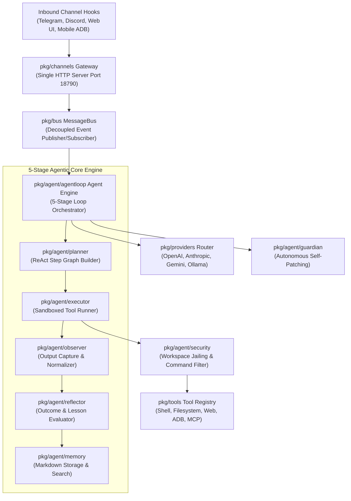
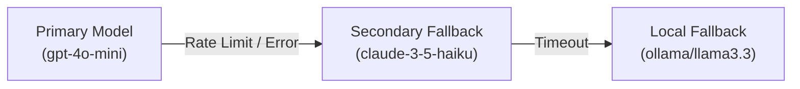

# MalikClaw Architecture Guide 🏛️

This document details the internal architecture, subsystem design, data flow, and Go package structure of **MalikClaw**. Engineered in Go for ultra-low memory consumption (`<10MB` RAM) and sub-second cold starts (`<1s`), MalikClaw decouples agentic reasoning from messaging protocols, LLM backends, and low-level hardware execution.

---

## 🏗️ 1. Subsystem Topology & Architecture Diagram



---

## 🔄 2. 5-Stage Agent Loop Sequence

The central execution engine (`pkg/agent/agentloop`) processes user goals through a resilient 5-stage loop cycle:

```mermaid
sequenceDiagram
    autonumber
    participant Client as User / Gateway Channel
    participant Loop as AgentLoop Orchestrator
    participant Planner as ReAct Planner
    participant Executor as Sandboxed Tool Executor
    participant Observer as Output Observer
    participant Reflector as Reflection Engine
    participant Memory as Memory Manager
    participant Provider as LLM Provider Layer

    Client->>Loop: ExecuteGoal(ctx, goal)
    Loop->>Memory: LoadContext(SOUL.md, MEMORY.md)
    Memory-->>Loop: Context Prompt
    Loop->>Planner: GeneratePlan(goal, context)
    Planner->>Provider: Prompt with ReAct Schema
    Provider-->>Planner: Plan Steps & Tool Call
    
    loop Subtask Execution Cycle
        Planner->>Executor: ExecuteStep(tool, args)
        Executor->>Observer: Execute & Capture Raw Output
        Observer-->>Loop: Normalized Observation & Confidence
        Loop->>Reflector: EvaluateStep(observation)
        Reflector-->>Loop: Success / Step Correction
        Loop->>Memory: AppendEpisode(tool_call, result)
    end
    
    Loop->>Reflector: FinalReflection(goal, history)
    Reflector-->>Loop: ReflectionResult (Success=true)
    Loop->>Memory: UpdatePersistentMemory(lessons_learned)
    Loop-->>Client: Return ExecutionResult
```

---

## 🧩 3. Key Subsystems & Go Package Structure

```
malikclaw/
├── cmd/
│   └── malikclaw/          # Main CLI application entrypoint
├── pkg/
│   ├── agent/
│   │   ├── agentloop/      # Production 5-stage agent loop orchestrator
│   │   ├── planner/        # ReAct & heuristic subtask decomposition
│   │   ├── executor/       # Tool execution engine with exponential retry & circuit breaker
│   │   ├── observer/       # Output capture, normalization, & confidence scoring
│   │   ├── reflector/      # Task outcome evaluation & lesson extraction
│   │   ├── memory/         # Persistent Markdown memory manager & search index
│   │   └── guardian/       # Code auditing, self-patching & Guardian engine
│   ├── bus/                # Event-driven async MessageBus (Go channels)
│   ├── channels/           # Omnichannel adapters (Telegram, Discord, WhatsApp, TikTok, etc.)
│   ├── config/             # JSON configuration loader & validator
│   ├── providers/          # Protocol-agnostic LLM provider abstraction layer
│   ├── tools/              # Standard tool implementations (shell, file, web, adb, mcp)
│   └── state/              # Key-value state & session persistence
```

### Subsystem Breakdown:

### A. Omnichannel Gateway & MessageBus (`pkg/channels`, `pkg/bus`)
- **Normalized Inbound Handling**: Normalizes messages from 15+ external chat platforms and webhooks into standard internal events (`bus.Message`).
- **Single-Port Server**: A lightweight Go HTTP server on port 18790 handles all webhook endpoints simultaneously to maintain an idle footprint `<10MB` RAM.

### B. Production Agent Engine Loop (`pkg/agent/agentloop`)
- **Planner (`pkg/agent/planner`)**: Constructs goal graphs using ReAct prompt templates.
- **Executor (`pkg/agent/executor`)**: Dispatches tool executions with circuit breaker protection and exponential backoff retry.
- **Observer (`pkg/agent/observer`)**: Captures standard output, standard error, exit codes, and normalizes output into JSON schemas.
- **Reflector (`pkg/agent/reflector`)**: Evaluates intermediate execution steps and final goal attainment.
- **Memory Manager (`pkg/agent/memory`)**: Writes episodic logs into human-readable Markdown format.

### C. Protocol-Agnostic Provider Layer (`pkg/providers`)
- Implements a unified interface `providers.LLMProvider` for OpenAI, Anthropic, Gemini, Ollama, DeepSeek, Groq, Zhipu, OpenRouter, and ModelScope.
- **Fallback Chains**: Configurable automated model fallback chains route around rate limits, outages, or context limit breaches.



### D. Security & Directory Sandboxing (`pkg/agent/security`, `pkg/tools`)
- **Directory Jailing**: System paths outside `~/.malikclaw/workspace` are blocked by default.
- **Command Regex Filter**: Destructive commands (`rm -rf /`, `sudo`, raw disk formatting, untrusted downloader scripts) are intercepted and rejected.

### E. Markdown-First Memory Engine
All state is stored in plain, human-readable Markdown files:
- **`SOUL.md`**: Core identity guidelines and tone constraints.
- **`IDENTITY.md`**: Assistant metadata and capabilities.
- **`USER.md`**: User preferences and context.
- **`MEMORY.md`**: Long-term episodic memory logs and learned lessons.

---

## 💻 4. Programmatic Go Code Example

Here is how to instantiate and execute the core agent loop programmatically in Go:

```go
package main

import (
	"context"
	"fmt"
	"log"
	"time"

	"github.com/AbdullahMalik17/malikclaw/pkg/agent/agentloop"
	"github.com/AbdullahMalik17/malikclaw/pkg/providers"
	"github.com/AbdullahMalik17/malikclaw/pkg/tools"
)

func main() {
	ctx, cancel := context.WithTimeout(context.Background(), 5*time.Minute)
	defer cancel()

	// 1. Initialize Provider
	provider, err := providers.NewOpenAIProvider("sk-proj-your-key", "gpt-4o-mini")
	if err != nil {
		log.Fatalf("Failed to initialize provider: %v", err)
	}

	// 2. Initialize Sandboxed Tools
	toolRegistry := tools.NewRegistry("/home/user/.malikclaw/workspace")
	if err := toolRegistry.RegisterDefaults(); err != nil {
		log.Fatalf("Failed to register tools: %v", err)
	}

	// 3. Configure Loop Options
	cfg := agentloop.DefaultLoopConfig("/home/user/.malikclaw/workspace")
	cfg.MaxIterations = 15
	cfg.EnableReflection = true

	// 4. Create and Execute Agent Loop
	loop := agentloop.NewAgentLoop(cfg, toolRegistry, provider)
	defer loop.Close()

	goal := "Check system disk usage and write a report to disk_health.md"
	res, err := loop.ExecuteGoal(ctx, goal)
	if err != nil {
		log.Fatalf("Agent error: %v", err)
	}

	fmt.Printf("Goal Completed: %t | Actions: %d | Time: %s\n",
		res.Success, res.ActionsTaken, res.Duration)
}
```

---

## 🎯 Architectural Principles

1. **Zero Unnecessary Bloat**: No heavy virtualenvs, node_modules runtime overhead, or unnecessary abstractions.
2. **Resilience by Default**: Circuit breakers, retry backoffs, and fallback chains prevent cascading failures.
3. **Transparent State**: Plain Markdown memory ensures all agent knowledge remains human-auditable and editable.
