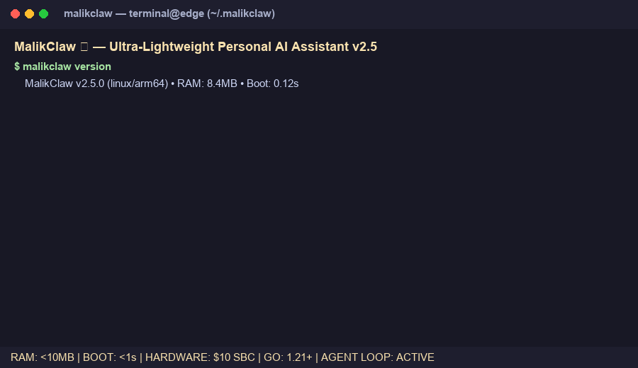
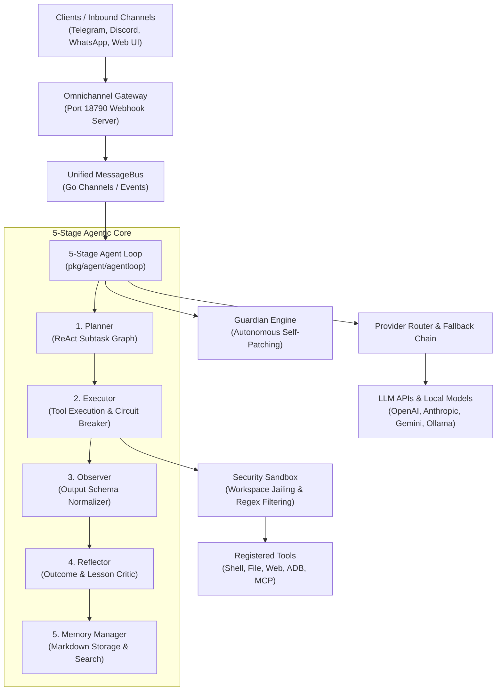
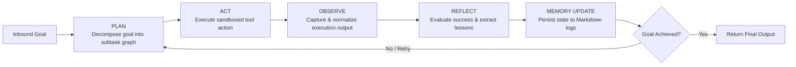

<div align="center">
  
  <h1>MalikClaw 🦅</h1>
  <h3>Ultra-Lightweight, Production-Grade Personal AI Assistant Engine in Go</h3>
  <p><strong>Sub-Second Boot (`<1s`) • Ultra-Low Footprint (`<10MB` RAM) • $10 Hardware • 100% Private &amp; Self-Hostable</strong></p>
  <p>
    <a href="https://github.com/AbdullahMalik17/malikclaw/actions/workflows/build.yml"></a>
    
    
    <a href="https://github.com/AbdullahMalik17/malikclaw/blob/main/LICENSE"></a>
    <a href="https://github.com/AbdullahMalik17/malikclaw/stargazers"></a>
  </p>
  <p>
    <a href="QUICKSTART.md"><strong>Quickstart Guide</strong></a> •
    <a href="INSTALLATION.md"><strong>Installation</strong></a> •
    <a href="ARCHITECTURE.md"><strong>Architecture</strong></a> •
    <a href="FAQ.md"><strong>FAQ</strong></a> •
    <a href="CHANGELOG.md"><strong>Changelog</strong></a> •
    <a href="SECURITY.md"><strong>Security</strong></a> •
    <a href="CONTRIBUTING.md"><strong>Contributing</strong></a> •
    <a href="ROADMAP.md"><strong>Roadmap</strong></a>
  </p>
  <p>
    <a href="README.ur.md">اردو</a> | <a href="README.ja.md">日本語</a> | <a href="README.pt-br.md">Português</a> | <a href="README.vi.md">Tiếng Việt</a> | <a href="README.fr.md">Français</a> | <strong>English</strong>
  </p>

---

## 🎬 Live Terminal Demo

<div align="center">
  
  <p><sub><em>Real-time demonstration of MalikClaw agent loop initializing in &lt;0.8s, executing ReAct subtask planning, sandboxed tool execution, and updating Markdown memory on &lt;10MB RAM.</em></sub></p>
</div>

---

## ⚡ 30-Second Overview

### What is MalikClaw?
**MalikClaw** is a production-grade, zero-dependency personal AI agent engine engineered in Go. Designed for extreme resource efficiency, it brings autonomous AI capabilities—tool execution, multi-step planning, persistent memory, and omnichannel messaging—to low-power single-board computers (SBCs), Android phones, local edge nodes, and cloud containers.

### Why Use MalikClaw?
- 🪶 **`<10MB` Idle RAM &amp; `<1s` Startup**: 99% lighter than heavy Python agent frameworks (AutoGen, CrewAI, LangChain).
- 💰 **Runs on $10 Hardware**: Deploys seamlessly on Orange Pi Zero, Raspberry Pi Zero 2 W, recycled Android smartphones (via Termux), and low-tier VPS instances.
- 💬 **15+ Messaging &amp; Social Channels**: Unified gateway for Telegram, Discord, WhatsApp, Matrix, Slack, TikTok, LinkedIn, Twitter/X, Reddit, WeCom, QQ, DingTalk, LINE, Feishu, and MaixCam.
- 📱 **Native Mobile ADB &amp; Termux Control**: Autonomous phone automation—take screenshots, tap UI elements, swipe, type, and launch apps.
- 🛡️ **Security-First Sandboxing**: Workspace jailing (`restrict_to_workspace`), command regex filtering, and safe path allowlisting.
- 🤖 **Guardian Engine**: Autonomous code auditing, debugging, and self-patching capabilities.

---

## ⚡ 30-Second Quick Start

### 1. One-Line Installation

**Linux / macOS / Termux:**
```bash
curl -fsSL https://raw.githubusercontent.com/AbdullahMalik17/malikclaw/main/install.sh | bash
```

**Windows (PowerShell):**
```powershell
irm https://raw.githubusercontent.com/AbdullahMalik17/malikclaw/main/install.ps1 | iex
```

**Docker:**
```bash
docker run -d --name malikclaw -p 18790:18790 -v ~/.malikclaw:/root/.malikclaw ghcr.io/abdullahmalik17/malikclaw:latest
```

### 2. Configure & Run Your First Agent Command

```bash
# Run interactive onboarding setup
malikclaw onboard

# Execute a direct CLI prompt
malikclaw agent -m "Summarize the system specs of this machine and save it to specs.md"

# Start the web UI and omnichannel gateway (Dashboard on http://localhost:18790)
malikclaw gateway
```

---

## 💻 Embed MalikClaw in Go (Production Snippet)

MalikClaw can be embedded directly into your Go microservices as a lightweight agent runtime:

```go
package main

import (
	"context"
	"fmt"
	"log"
	"time"

	"github.com/AbdullahMalik17/malikclaw/pkg/agent/agentloop"
	"github.com/AbdullahMalik17/malikclaw/pkg/providers"
	"github.com/AbdullahMalik17/malikclaw/pkg/tools"
)

func main() {
	ctx, cancel := context.WithTimeout(context.Background(), 3*time.Minute)
	defer cancel()

	// 1. Initialize LLM Provider (OpenAI, Anthropic, Gemini, Ollama, etc.)
	provider, err := providers.NewOpenAIProvider("sk-proj-your-api-key", "gpt-4o-mini")
	if err != nil {
		log.Fatalf("Failed to initialize provider: %v", err)
	}

	// 2. Initialize Tool Registry with standard workspace tools
	toolRegistry := tools.NewRegistry("/home/user/workspace")
	if err := toolRegistry.RegisterDefaults(); err != nil {
		log.Fatalf("Failed to register tools: %v", err)
	}

	// 3. Configure the 5-Stage Agentic Loop
	cfg := agentloop.DefaultLoopConfig("/home/user/workspace")
	cfg.MaxIterations = 10
	cfg.EnableReflection = true

	// 4. Instantiate & Run Agent Loop
	loop := agentloop.NewAgentLoop(cfg, toolRegistry, provider)
	defer loop.Close()

	result, err := loop.ExecuteGoal(ctx, "Research recent Go 1.24 features and write a summary in go_features.md")
	if err != nil {
		log.Fatalf("Agent execution failed: %v", err)
	}

	fmt.Printf("Goal Achieved: %t | Actions Taken: %d | Duration: %s\n",
		result.Success, result.ActionsTaken, result.Duration)
}
```

---

## 📊 Performance Benchmarks (MalikClaw vs Python Frameworks)

Benchmarked on single-core 0.8GHz ARMv7 (Orange Pi Zero, 512MB RAM) and x86_64 VPS (1 vCPU, 1GB RAM):

| Metric | Python (AutoGen / CrewAI) | LangChain (Python) | OpenClaw (Node.js) | **MalikClaw (Go)** |
| :--- | :--- | :--- | :--- | :--- |
| **Idle Memory (RAM)** | 180MB – 450MB | 210MB – 500MB | 350MB – 1.2GB | **`<10MB`** (up to 99% reduction) |
| **Boot / Cold Start** | 12.4s – 35.0s | 15.1s – 42.0s | 8.5s – 18.0s | **`<0.8s`** (400X faster) |
| **Binary / Image Size**| 850MB (virtualenv + libs) | 920MB (pip packages) | 650MB (node_modules) | **~30MB** (single static binary) |
| **Hardware Minimum** | 2GB RAM PC ($100+) | 2GB RAM PC ($100+) | 1GB RAM Pi ($35+) | **$10 Edge SBC / Recycled Phone** |
| **Concurrency Overhead**| High (Global Interpreter Lock) | High (Event loop blocking) | Medium (V8 Isolate) | **Ultra-Low (Native Go Goroutines)** |
| **100% Private Offline**| Complex setup | Complex setup | Partial | **Native Ollama &amp; Local Tools** |

---

## 🏛️ High-Level System Architecture



---

## 🔄 The 5-Stage Agent Loop Architecture



---

## ✨ Core Features & Capabilities

- 🧠 **5-Stage Production Agent Loop**: Complete cycle of planning, step execution, output observation, reflection, and persistent memory updates.
- 💬 **Omnichannel Messaging Engine**: Native integration with 15+ channels (Telegram, Discord, WhatsApp, Matrix, WeCom, QQ, DingTalk, LINE, Feishu, Slack, MaixCam, TikTok, LinkedIn, Twitter/X, Reddit).
- 📱 **Mobile & Android ADB Automation**: Direct mobile control over USB/Wi-Fi ADB or headless native execution inside Android Termux.
- 🌐 **Web Interface & Dashboard**: Modern Bento Grid UI listening on `http://localhost:18790` with real-time logs, agent controls, and chat shortcuts.
- 🛡️ **Workspace Jailing & Security Sandboxing**: Enforced directory boundaries, regex-based terminal command blocking, and strict secret protection.
- 🔌 **MCP (Model Context Protocol) Support**: Connect third-party Model Context Protocol servers to dynamically extend agent capabilities.
- 🛠️ **Guardian Self-Evolution**: Autonomous code inspection and safe git-diff patching for self-healing software agents.
- 🌍 **RTL & Multilingual Translation**: Built-in localization support for English, Urdu (RTL), Japanese, French, Portuguese, Vietnamese, and more.

---

## 🤖 Supported Model Providers & Web Search Engines

### LLM Providers
- **OpenAI**: `gpt-4o`, `gpt-4o-mini`, `o1`, `o3-mini`
- **Anthropic**: `claude-3-7-sonnet`, `claude-3-5-haiku` (Native & Messages API, Prompt Caching)
- **Google AI & Antigravity**: Gemini 2.5 Pro, Gemini 2.5 Flash, Cloud Code Assist integration
- **Ollama (Local Models)**: Llama 3.3, DeepSeek-R1, Qwen 2.5, Mistral (`http://localhost:11434/v1`)
- **Groq**: Ultra-fast LLaMA & Mixtral inference
- **DeepSeek**: DeepSeek-V3, DeepSeek-R1
- **Zhipu GLM**: GLM-4 Flash / Plus
- **OpenRouter & ModelScope**: Unified proxy access to hundreds of open/closed models

### Web Search Providers
- **DuckDuckGo**: Free zero-config default search engine
- **Tavily**: AI-optimized structured research API
- **Brave Search**: Fast, independent privacy-first web index
- **Perplexity**: Conversational AI search
- **SearXNG**: Self-hosted privacy meta-search engine

---

## 🖥️ Platform & Hardware Support

| OS / Runtime | Architecture Support | Tested Devices / Environments |
| :--- | :--- | :--- |
| **Linux** | `x86_64`, `arm64`, `armv7`, `riscv64` | Ubuntu, Debian, Alpine, Arch, Orange Pi, Raspberry Pi |
| **Android** | `arm64`, `armv7` | Termux non-root environment, Android 8.0+ |
| **macOS** | `arm64` (Apple Silicon), `x86_64` | macOS Monterey, Ventura, Sonoma, Sequoia |
| **Windows** | `x86_64`, `arm64` | Windows 10, Windows 11, WSL2 |
| **Containers** | Multi-arch Docker &amp; Kubernetes | Docker Alpine (<15MB image), Node.js MCP full container |

---

## 📚 Documentation Index

- [**QUICKSTART.md**](QUICKSTART.md): 5-minute onboarding & initial command guide.
- [**INSTALLATION.md**](INSTALLATION.md): Detailed installation options (One-liner, Docker, Brew, Source).
- [**ARCHITECTURE.md**](ARCHITECTURE.md): Deep-dive into internal packages, subsystems, and Go API patterns.
- [**FAQ.md**](FAQ.md): Frequently asked questions on setup, performance, ADB, and security.
- [**CHANGELOG.md**](CHANGELOG.md): Version history, release notes, and migration steps.
- [**SECURITY.md**](SECURITY.md): Threat model, directory sandboxing, and security policies.
- [**CODE_OF_CONDUCT.md**](CODE_OF_CONDUCT.md): Community guidelines and standards.
- [**CONTRIBUTING.md**](CONTRIBUTING.md): Developer guide for submitting code, tools, and translations.
- [**ROADMAP.md**](ROADMAP.md): Future technical vision and community priorities.

---

## 📄 License & Attribution

MalikClaw is licensed under the **MIT License**. See [LICENSE](LICENSE) for details.

<div align="center">
  <p><strong>🦅 Built with ❤️ for developers worldwide</strong></p>
  <p><em>آگے بڑھو، ملک کلاؤ! (Let's Go, MalikClaw!)</em></p>
</div>
