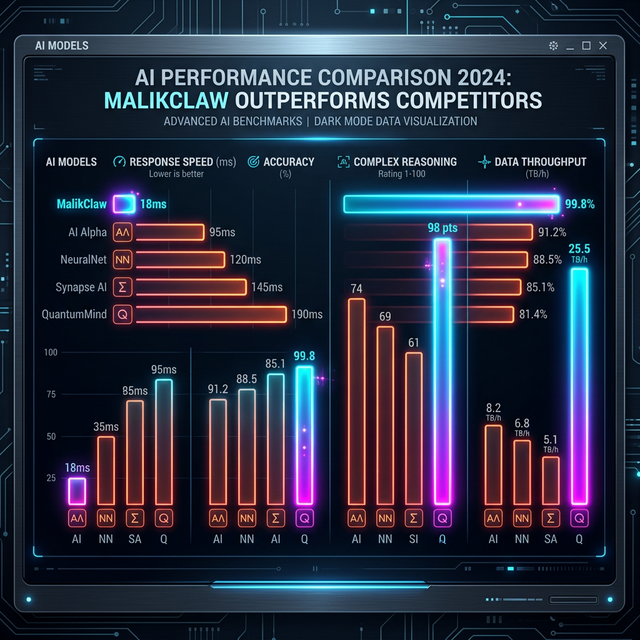
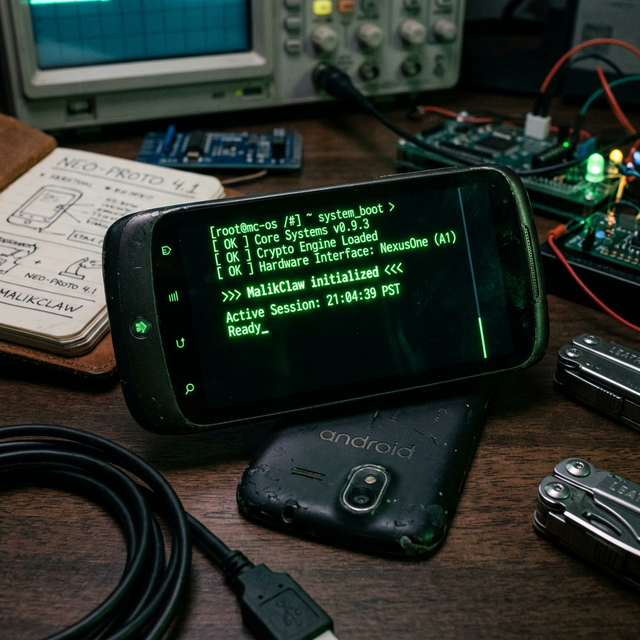
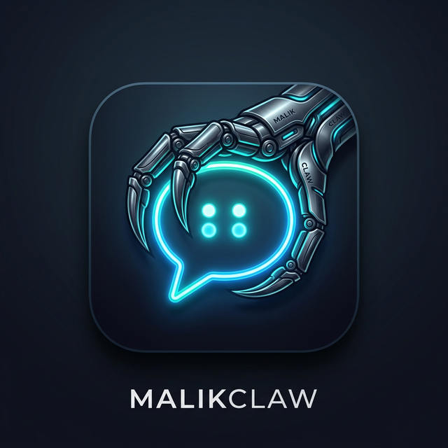

<div align="center">


<h1>MalikClaw: Go زبان پر مبنی ایک انتہائی موثر AI اسسٹنٹ</h1>

<h3>$10 ہارڈ ویئر · 10MB میموری · 1 سیکنڈ اسٹارٹ اپ · پی پی ژیا، چلو چلیں!</h3>

  <p>
    
    
    
    <br>
    <a href="https://malikclaw.io"></a>
    <a href="https://x.com/SipeedIO"></a>
  </p>

[چینی](README.zh.md) | [جاپانی](README.ja.md) | [پرتگالی](README.pt-br.md) | [ویتنامی](README.vi.md) | [فرانسیسی](README.fr.md) | [انگریزی](README.md) | **اردو**

</div>

---

🦐 **MalikClaw** ایک انتہائی ہلکا پھلکا ذاتی AI اسسٹنٹ ہے جو [nanobot](https://github.com/HKUDS/nanobot) سے متاثر ہے۔ اسے **Go زبان** کا استعمال کرتے ہوئے صفر سے دوبارہ تیار کیا گیا ہے، اور یہ ایک "بوٹسٹریپنگ" عمل سے گزرا ہے—یعنی AI ایجنٹ نے خود ہی مکمل آرکیٹیکچر کی منتقلی اور کوڈ کی اصلاح کو چلایا ہے۔

⚡️ **انتہائی ہلکا پھلکا**: یہ **$10** کے ہارڈ ویئر پر چل سکتا ہے، اور میموری کا استعمال **10MB سے کم** ہے۔ اس کا مطلب ہے کہ یہ OpenClaw کے مقابلے میں 99% میموری بچاتا ہے اور Mac mini سے 98% سستا ہے!

<table align="center">
<tr align="center">
<td align="center" valign="top">
<p align="center">

</p>
</td>
<td align="center" valign="top">
<p align="center">

</p>
</td>
</tr>
</table>

توجہ فرمائیں: محدود افرادی قوت کی وجہ سے، چینی دستاویزات تھوڑی پیچھے ہو سکتی ہیں، براہ کرم انگریزی دستاویزات کو ترجیح دیں۔

> [!CAUTION]
> **🚨 سیکیورٹی اور آفیشل چینلز / حفاظتی بیان**
>
> - **کوئی کرپٹو کرنسی نہیں (NO CRYPTO):** MalikClaw نے کوئی آفیشل ٹوکن، کوائن یا ورچوئل کرنسی جاری **نہیں** کی ہے۔ `pump.fun` یا دیگر تجارتی پلیٹ فارمز پر اس طرح کے تمام دعوے **فریب (scam)** ہیں۔
> - **آفیشل ڈومین:** واحد آفیشل ویب سائٹ **[malikclaw.io](https://malikclaw.io)** ہے، اور کمپنی کی آفیشل ویب سائٹ **[sipeed.com](https://sipeed.com)** ہے۔
> - **ہوشیار رہیں:** بہت سے ڈومینز جن کے آخر میں `.ai/.org/.com/.net/...` آتا ہے، تیسرے فریقوں کی طرف سے رجسٹر کیے گئے ہیں، ان پر بھروسہ نہ کریں۔
> - **نوٹ:** MalikClaw فی الحال ابتدائی تیز رفتار فنکشن ڈویلپمنٹ مرحلے میں ہے، اس میں سیکیورٹی کے مسائل ہو سکتے ہیں جو ابھی تک ٹھیک نہیں ہوئے ہیں۔ ورژن 1.0 کی آفیشل ریلیز سے پہلے، براہ کرم اسے پروڈکشن ماحول میں تعینات نہ کریں۔
> - **نوٹ:** MalikClaw نے حال ہی میں بڑی تعداد میں PRs ضم کیے ہیں، حالیہ ورژن زیادہ میموری (10~20MB) استعمال کر سکتے ہیں۔ فنکشنز کے مستحکم ہونے کے بعد ہم وسائل کے استعمال کو بہتر بنائیں گے۔

## 📢 خبریں (News)

2026-02-16 🎉 MalikClaw نے ایک ہفتے میں 12K اسٹارز مکمل کر لیے! آپ سب کی توجہ کا شکریہ! MalikClaw کی ترقی کی رفتار ہماری توقعات سے زیادہ ہے۔ PRs کی بڑھتی ہوئی تعداد کی وجہ سے، ہمیں کمیونٹی ڈویلپرز کی مدد کی اشد ضرورت ہے۔ رضاکاروں کے کردار اور روڈ میپ [یہاں](docs/ROADMAP.md) شائع کر دیا گیا ہے، ہم آپ کی شرکت کے منتظر ہیں!

2026-02-13 🎉 **MalikClaw نے 4 دنوں میں 5000 اسٹارز مکمل کر لیے!** کمیٹی کی حمایت کا شکریہ! چونکہ اس وقت چینی نئے سال کی چھٹیاں ہیں، اس لیے PRs اور ایشوز کی بھرمار ہے۔ ہم اس وقت کا استعمال **پروجیکٹ روڈ میپ (Roadmap)** کو حتمی شکل دینے اور **ڈویلپر گروپ** بنانے کے لیے کر رہے ہیں تاکہ MalikClaw کی ترقی کو تیز کیا جا سکے۔
🚀 **کال ٹو ایکشن:** براہ کرم GitHub Discussions میں اپنی فیچر درخواستیں (Feature Requests) جمع کرائیں۔ ہم آنے والے ہفتہ وار اجلاسوں میں ان کا جائزہ لیں گے اور ترجیحات کا تعین کریں گے۔

2026-02-09 🎉 **MalikClaw باضابطہ طور پر ریلیز کر دیا گیا!** اسے صرف 1 دن میں بنایا گیا ہے، جس کا مقصد AI ایجنٹ کو $10 ہارڈ ویئر اور 10MB سے کم میموری کی دنیا میں لانا ہے۔ 🦐 MalikClaw (پی پی ژیا)، چلو چلیں!

## ✨ خصوصیات

🪶 **انتہائی ہلکا پھلکا**: بنیادی فنکشنز کے لیے میموری کا استعمال 10MB سے کم ہے — Clawdbot سے 99% چھوٹا۔

💰 **انتہائی کم لاگت**: یہ اتنا موثر ہے کہ $10 کے ہارڈ ویئر پر چل سکتا ہے — Mac mini سے 98% سستا۔

⚡️ **بجلی جیسی تیز شروعات**: اسٹارٹ اپ کی رفتار 400 گنا زیادہ تیز ہے، یہاں تک کہ 0.6GHz سنگل کور پروسیسر پر بھی یہ 1 سیکنڈ کے اندر شروع ہو سکتا ہے۔

🌍 **حقیقی طور پر پورٹیبل**: RISC-V، ARM، MIPS اور x86 آرکیٹیکچر کے لیے سنگل بائنری فائل، ایک کلک میں چلائیں!

🤖 **AI بوٹسٹریپنگ**: خالص Go زبان میں مقامی طور پر تیار کردہ — 95% بنیادی کوڈ ایجنٹ کے ذریعے تیار کیا گیا ہے، اور "Human-in-the-loop" کے ذریعے اسے فائن ٹیون کیا گیا ہے۔

|                                | OpenClaw      | NanoBot                  | **MalikClaw**                           |
| ------------------------------ | ------------- | ------------------------ | -------------------------------------- |
| **زبان**                       | TypeScript    | Python                   | **Go**                                 |
| **RAM**                        | >1GB          | >100MB                   | **< 10MB**                             |
| **شروع ہونے کا وقت**</br>(0.8GHz کور) | >500s         | >30s                     | **<1s**                                |
| **لاگت**                       | Mac Mini $599 | زیادہ تر لینکس بورڈز ~$50 | **کوئی بھی لینکس بورڈ**</br>**صرف $10** |



## 🦾 ڈیمو

### 🛠️ اسٹینڈرڈ اسسٹنٹ ورک فلو

<table align="center">
<tr align="center">
<th><p align="center">🧩 فل اسٹیک انجینئر موڈ</p></th>
<th><p align="center">🗂️ لاگز اور پلاننگ مینجمنٹ</p></th>
<th><p align="center">🔎 ویب سرچ اور لرننگ</p></th>
</tr>
<tr>
<td align="center"><p align="center"></p></td>
<td align="center"><p align="center"></p></td>
<td align="center"><p align="center"></p></td>
</tr>
<tr>
<td align="center">ڈویلپمنٹ • تعیناتی • توسیع</td>
<td align="center">شیڈول • آٹومیشن • میموری</td>
<td align="center">دریافت • بصیرت • رجحان</td>
</tr>
</table>

### 📱 موبائل پر آسانی سے چلائیں

MalikClaw آپ کے 10 سال پرانے فون کو دوبارہ استعمال کے قابل بنا کر اسے آپ کا AI اسسٹنٹ بنا سکتا ہے! فوری گائیڈ:

1. ایپ اسٹور سے Termux ڈاؤن لوڈ اور انسٹال کریں۔
2. اسے کھولنے کے بعد درج ذیل کمانڈ چلائیں:

```bash
# نوٹ: نیچے دیئے گئے v0.1.1 کو آپ تازہ ترین ورژن سے بدل سکتے ہیں جو آپ دیکھتے ہیں۔
wget https://github.com/sipeed/malikclaw/releases/download/v0.1.1/malikclaw-linux-arm64
chmod +x malikclaw-linux-arm64
pkg install proot
termux-chroot ./malikclaw-linux-arm64 onboard
```

اس کے بعد MalikClaw کو کنفیگر کرنے کے لیے نیچے دیے گئے "فوری آغاز" سیکشن پر عمل کریں!


### 🐜 جدید کم لاگت تعیناتی

MalikClaw تقریباً کسی بھی لینکس ڈیوائس پر تعینات کیا جا سکتا ہے!

- $9.9 [LicheeRV-Nano](https://www.aliexpress.com/item/1005006519668532.html) E(ایتھرنیٹ) یا W(WiFi6) ورژن، ایک سادہ گھریلو اسسٹنٹ کے لیے۔
- $30~50 [NanoKVM](https://www.aliexpress.com/item/1005007369816019.html)، یا $100 [NanoKVM-Pro](https://www.aliexpress.com/item/1005010048471263.html)，خودکار سرور مینجمنٹ کے لیے۔
- $50 [MaixCAM](https://www.aliexpress.com/item/1005008053333693.html) یا $100 [MaixCAM2](https://www.kickstarter.com/projects/zepan/maixcam2-build-your-next-gen-4k-ai-camera)，اسمارٹ مانیٹرنگ کے لیے۔

[https://private-user-images.githubusercontent.com/83055338/547056448-e7b031ff-d6f5-4468-bcca-5726b6fecb5c.mp4](https://private-user-images.githubusercontent.com/83055338/547056448-e7b031ff-d6f5-4468-bcca-5726b6fecb5c.mp4)

🌟 مزید تعیناتی کے کیسز جلد آ رہے ہیں!

## 📦 انسٹالیشن

### پہلے سے تیار شدہ بائنری فائلوں کا استعمال کرتے ہوئے انسٹالیشن

[Release صفحہ](https://github.com/sipeed/malikclaw/releases) سے اپنے پلیٹ فارم کے لیے موزوں فرم ویئر ڈاؤن لوڈ کریں۔

### سورس کوڈ سے انسٹالیشن (تازہ ترین خصوصیات حاصل کرنے کے لیے، ڈویلپمنٹ کے لیے تجویز کردہ)

```bash
git clone https://github.com/sipeed/malikclaw.git

cd malikclaw
make deps

# تعمیر (انسٹال کرنے کی ضرورت نہیں)
make build

# کثیر پلیٹ فارم کے لیے تعمیر
make build-all

# تعمیر اور انسٹالیشن
make install

```

## 🐳 Docker Compose

آپ کسی بھی مقامی ماحول کو انسٹال کیے بغیر Docker Compose کا استعمال کرتے ہوئے MalikClaw بھی چلا سکتے ہیں۔

```bash
# 1. ریپوزٹری کلون کریں
git clone https://github.com/sipeed/malikclaw.git
cd malikclaw

# 2. پہلی بار چلائیں — خودکار طور پر docker/data/config.json بنانے کے بعد باہر نکلیں
docker compose -f docker/docker-compose.yml --profile gateway up
# کنٹینر "First-run setup complete." پرنٹ کرنے کے بعد خود بخود رک جائے گا

# 3. API Key وغیرہ کنفیگر کریں
vim docker/data/config.json   # فراہم کنندہ کی API key، Bot Token وغیرہ سیٹ کریں

# 4. باضابطہ طور پر شروع کریں
docker compose -f docker/docker-compose.yml --profile gateway up -d
```

> [!TIP]
> **Docker صارفین**: ڈیفالٹ طور پر، Gateway `127.0.0.1` پر سنتا ہے، یہ پورٹ کنٹینر سے باہر ظاہر نہیں ہوگی۔ اگر آپ پورٹ میپنگ کے ذریعے ہیلتھ چیک انٹرفیس تک رسائی حاصل کرنا چاہتے ہیں، تو براہ کرم ماحولیاتی متغیرات میں `MALIKCLAW_GATEWAY_HOST=0.0.0.0` سیٹ کریں یا `config.json` میں ترمیم کریں۔

```bash
# 5. لاگز دیکھیں
docker compose -f docker/docker-compose.yml logs -f malikclaw-gateway

# 6. روکیں
docker compose -f docker/docker-compose.yml --profile gateway down
```

### ایجنٹ موڈ (ایک بار چلائیں)

```bash
# سوال پوچھیں
docker compose -f docker/docker-compose.yml run --rm malikclaw-agent -m "2+2 کتنا ہوتا ہے؟"

# انٹرایکٹو موڈ
docker compose -f docker/docker-compose.yml run --rm malikclaw-agent
```

### امیج اپ ڈیٹ کریں

```bash
docker compose -f docker/docker-compose.yml pull
docker compose -f docker/docker-compose.yml --profile gateway up -d
```

### 🚀 فوری آغاز

> [!TIP]
> اپنی API Key `~/.malikclaw/config.json` میں سیٹ کریں۔ API Key حاصل کریں: [Volcengine (CodingPlan)](https://www.volcengine.com/activity/codingplan?utm_campaign=MalikClaw&utm_content=MalikClaw&utm_medium=devrel&utm_source=OWO&utm_term=MalikClaw) (LLM) · [OpenRouter](https://openrouter.ai/keys) (LLM) · [Zhipu](https://open.bigmodel.cn/usercenter/proj-mgmt/apikeys) (LLM)۔ ویب سرچ **اختیاری** ہے — مفت [Tavily API](https://tavily.com) (ماہانہ 1000 مفت سوالات) یا [Brave Search API](https://brave.com/search/api) (ماہانہ 2000 مفت سوالات) حاصل کریں۔

**1. ابتدائی ترتیب (Initialize)**

```bash
malikclaw onboard

```

**2. ترتیب (Configure)** (`~/.malikclaw/config.json`)

```json
{
  "agents": {
    "defaults": {
      "workspace": "~/.malikclaw/workspace",
      "model_name": "gpt-5.4",
      "max_tokens": 8192,
      "temperature": 0.7,
      "max_tool_iterations": 20
    }
  },
  "model_list": [
    {
      "model_name": "ark-code-latest",
      "model": "volcengine/ark-code-latest",
      "api_key": "sk-your-api-key",
      "api_base":"https://ark.cn-beijing.volces.com/api/coding/v3"
    },
    {
      "model_name": "gpt-5.4",
      "model": "openai/gpt-5.4",
      "api_key": "your-api-key",
      "request_timeout": 300
    },
    {
      "model_name": "claude-sonnet-4.6",
      "model": "anthropic/claude-sonnet-4.6",
      "api_key": "your-anthropic-key"
    }
  ],
  "tools": {
    "web": {
      "brave": {
        "enabled": false,
        "api_key": "YOUR_BRAVE_API_KEY",
        "max_results": 5
      },
      "tavily": {
        "enabled": false,
        "api_key": "YOUR_TAVILY_API_KEY",
        "max_results": 5
      }
    },
    "cron": {
      "exec_timeout_minutes": 5
    }
  }
}
```

> **نیا فیچر**: `model_list` کنفیگریشن فارمیٹ بغیر کوڈ کے فراہم کنندگان کو شامل کرنے کی اجازت دیتا ہے۔ تفصیلات کے لیے [ماڈل لسٹ](#ماڈل-ترتیب-model_list) سیکشن دیکھیں۔
> `request_timeout` اختیاری ہے، سیکنڈز میں۔ اگر اسے چھوڑ دیا جائے یا `<= 0` سیٹ کیا جائے، تو MalikClaw ڈیفالٹ ٹائم آؤٹ (120 سیکنڈ) استعمال کرے گا۔

**3. API Key حاصل کریں**

* **LLM فراہم کنندگان**: [OpenRouter](https://openrouter.ai/keys) · [Zhipu](https://open.bigmodel.cn/usercenter/proj-mgmt/apikeys) · [Anthropic](https://console.anthropic.com) · [OpenAI](https://platform.openai.com) · [Gemini](https://aistudio.google.com/api-keys)
* **ویب سرچ** (اختیاری): [Tavily](https://tavily.com) - AI ایجنٹس کے لیے بہترین (1000 درخواستیں/ماہ) · [Brave Search](https://brave.com/search/api) - مفت ٹیر فراہم کرتا ہے (2000 درخواستیں/ماہ)

> **نوٹ**: مکمل کنفیگریشن ٹیمپلیٹ کے لیے `config.example.json` دیکھیں۔

**4. بات چیت (Chat)**

```bash
malikclaw agent -m "2+2 کتنا ہوتا ہے؟"

```

بس یہی ہے! آپ کے پاس 2 منٹ کے اندر کام کرنے والا AI اسسٹنٹ تیار ہو گیا۔

---

## 💬 چیٹ ایپس انٹیگریشن (Chat Apps)

MalikClaw متعدد چیٹ پلیٹ فارمز کو سپورٹ کرتا ہے، جس سے آپ کا ایجنٹ کہیں بھی جڑ سکتا ہے۔

> **نوٹ**: تمام Webhook چینلز (LINE، WeCom وغیرہ) ایک ہی Gateway HTTP سرور (`gateway.host`:`gateway.port` پر چلتے ہیں، ڈیفالٹ `127.0.0.1:18790`)۔ ہر چینل کے لیے الگ پورٹ سیٹ کرنے کی ضرورت نہیں ہے۔ نوٹ: Feishu (لکشمی) WebSocket/SDK موڈ استعمال کرتا ہے اور اس مشترکہ HTTP ویب ہک سرور کے ذریعے پیغامات وصول نہیں کرتا۔

### بنیادی چینلز

| چینل                 | سیٹ اپ مشکل    | خصوصیات                                  | دستاویز لنک                                                                                                        |
| -------------------- | ----------- | ----------------------------------------- | --------------------------------------------------------------------------------------------------------------- |
| **Telegram**         | ⭐ آسان     | تجویز کردہ، وائس ٹو ٹیکسٹ کو سپورٹ کرتا ہے، پبلک آئی پی کی ضرورت نہیں | [دستاویز دیکھیں](docs/channels/telegram/README.ur.md)                                                                 |
| **Discord**          | ⭐ آسان     | Socket Mode، گروپس اور نجی پیغامات کو سپورٹ کرتا ہے | [دستاویز دیکھیں](docs/channels/discord/README.ur.md)                                                                  |
| **Slack**            | ⭐ آسان     | **Socket Mode** (پبلک آئی پی کی ضرورت نہیں)، انٹرپرائز سپورٹ | [دستاویز دیکھیں](docs/channels/slack/README.ur.md)                                                                    |
| **Matrix**           | ⭐⭐ درمیانہ   | فیڈریٹڈ پروٹوکول، خود میزبان ہوم سرورز کو سپورٹ کرتا ہے | [دستاویز دیکھیں](docs/channels/matrix/README.ur.md)                                                                  |
| **QQ**               | ⭐⭐ درمیانہ   | آفیشل بوٹ API، چینی کمیونٹیز کے لیے موزوں              | [دستاویز دیکھیں](docs/channels/qq/README.ur.md)                                                                       |
| **钉钉 (DingTalk)**  | ⭐⭐ درمیانہ   | Stream موڈ، پبلک آئی پی کی ضرورت نہیں، دفتری کام کے لیے بہترین | [دستاویز دیکھیں](docs/channels/dingtalk/README.ur.md)                                                                 |
| **企业微信 (WeCom)** | ⭐⭐⭐ مشکل | گروپ بوٹس، کسٹم ایپس اور اسمارٹ بوٹس کو سپورٹ کرتا ہے | [Bot دستاویز](docs/channels/wecom/wecom_bot/README.ur.md) / [App دستاویز](docs/channels/wecom/wecom_app/README.ur.md) / [AI Bot دستاویز](docs/channels/wecom/wecom_aibot/README.ur.md) |
| **飞书 (Feishu)**    | ⭐⭐⭐ مشکل | انٹرپرائز لیول تعاون، بھرپور خصوصیات                      | [دستاویز دیکھیں](docs/channels/feishu/README.ur.md)                                                                   |
| **Line**             | ⭐⭐⭐ مشکل | HTTPS Webhook کی ضرورت ہے                        | [دستاویز دیکھیں](docs/channels/line/README.ur.md)                                                                     |
| **OneBot**           | ⭐⭐ درمیانہ   | NapCat/Go-CQHTTP کے ساتھ ہم آہنگ       | [دستاویز دیکھیں](docs/channels/onebot/README.ur.md)                                                                   |
| **MaixCam**          | ⭐ آسان     | AI کیمروں کے لیے خصوصی ہارڈ ویئر انٹیگریشن چینل          | [دستاویز دیکھیں](docs/channels/maixcam/README.ur.md)                                                                  |

### Telegram کمانڈ رجسٹریشن (اسٹارٹ اپ پر خودکار مطابقت پذیری)

MalikClaw اب کمانڈ کی تعریف کا ایک متحدہ ذریعہ استعمال کرتا ہے۔ اسٹارٹ اپ کے وقت، Telegram کے تعاون یافتہ کمانڈز (مثلاً `/start`, `/help`, `/show`, `/list`) خود بخود بوٹ کمانڈ مینو میں رجسٹر ہو جائیں گے، تاکہ مینو اور اصل طرز عمل ایک جیسا رہے۔
Telegram کی طرف کمانڈ مینو کی رجسٹریشن کی صلاحیت برقرار ہے؛ عام کمانڈز کی اصل تعمیل ایجنٹ لوپ میں کمانڈ ایگزیکوٹر کے ذریعے ہوتی ہے۔

اگر نیٹ ورک یا API کے عارضی مسئلے کی وجہ سے رجسٹریشن ناکام ہو جاتی ہے، تو یہ چینل کے اسٹارٹ اپ کو نہیں روکے گا؛ سسٹم پس منظر میں خود بخود دوبارہ کوشش کرے گا۔

##  ایجنٹ سوشل نیٹ ورک میں شامل ہوں

صرف CLI یا کسی بھی مربوط چیٹ ایپ کے ذریعے ایک پیغام بھیج کر MalikClaw کو ایجنٹ سوشل نیٹ ورک سے جوڑیں۔

`https://clawdchat.ai/skill.md` پڑھیں اور [ClawdChat.ai](https://clawdchat.ai) میں شامل ہونے کی ہدایات پر عمل کریں۔

## ⚙️ کنفیگریشن کی تفصیلات

کنفیگریشن فائل کا راستہ: `~/.malikclaw/config.json`

### ماحولیاتی متغیرات (Environment Variables)

آپ ڈیفالٹ راستوں کو اوور رائڈ کرنے کے لیے ماحولیاتی متغیرات استعمال کر سکتے ہیں۔ یہ پورٹیبل انسٹالیشن، کنٹینرائزڈ تعیناتی، یا سسٹم سروس کے طور پر چلانے کے لیے مفید ہے۔ یہ متغیرات آزاد ہیں اور مختلف راستوں کو کنٹرول کرتے ہیں۔

| متغیر              | تفصیل                                                                                                                             | ڈیفالٹ راستہ                  |
|-------------------|-----------------------------------------------------------------------------------------------------------------------------------------|---------------------------|
| `MALIKCLAW_CONFIG` | کنفیگریشن فائل کے راستے کو اوور رائڈ کرتا ہے۔ یہ MalikClaw کو بتاتا ہے کہ کون سی `config.json` لوڈ کرنی ہے، باقی تمام مقامات کو نظر انداز کر دیا جاتا ہے۔ | `~/.malikclaw/config.json` |
| `MALIKCLAW_HOME`   | MalikClaw ڈیٹا کی روٹ ڈائرکٹری کو اوور رائڈ کرتا ہے۔ یہ `workspace` اور دیگر ڈیٹا ڈائرکٹریز کا ڈیفالٹ مقام تبدیل کر دیتا ہے۔          | `~/.malikclaw`             |

**مثال:**

```bash
# مخصوص کنفیگریشن فائل کے ساتھ MalikClaw چلائیں
MALIKCLAW_CONFIG=/etc/malikclaw/production.json malikclaw gateway

# تمام ڈیٹا کو /opt/malikclaw میں محفوظ کرتے ہوئے MalikClaw چلائیں
MALIKCLAW_HOME=/opt/malikclaw malikclaw agent

# مکمل کسٹم سیٹ اپ کے لیے دونوں کا استعمال کریں
MALIKCLAW_HOME=/srv/malikclaw MALIKCLAW_CONFIG=/srv/malikclaw/main.json malikclaw gateway
```

### ورک اسپیس لے آؤٹ (Workspace Layout)

MalikClaw ڈیٹا کو آپ کے کنفیگر کردہ ورک اسپیس میں اسٹور کرتا ہے (ڈیفالٹ: `~/.malikclaw/workspace`):

```
~/.malikclaw/workspace/
├── sessions/          # بات چیت کے سیشن اور تاریخ
├── memory/           # طویل مدتی میموری (MEMORY.md)
├── state/            # مستقل حالت (آخری چینل وغیرہ)
├── cron/             # شیڈول ٹاسک ڈیٹا بیس
├── skills/           # کسٹم مہارتیں
├── AGENTS.md         # ایجنٹ کے رویے کی گائیڈ
├── HEARTBEAT.md      # وقتاً فوقتاً کاموں کے پرامپٹس (ہر 30 منٹ بعد چیک)
├── IDENTITY.md       # ایجنٹ کی شناخت کی ترتیب
├── SOUL.md           # ایجنٹ کی روح/شخصیت
└── USER.md           # صارف کی ترجیحات

```

### مہارتوں کے ذرائع (Skill Sources)

ڈیفالٹ طور پر، مہارتیں درج ذیل ترتیب میں لوڈ ہوتی ہیں:

1. `~/.malikclaw/workspace/skills` (ورک اسپیس)
2. `~/.malikclaw/skills` (عالمی)
3. `<current-working-directory>/skills` (ان بلٹ)

ایڈوانس/ٹیسٹنگ کے لیے، ماحولیاتی متغیر کے ذریعے ان بلٹ مہارتوں کی ڈائرکٹری کو اوور رائڈ کیا جا سکتا ہے:

```bash
export MALIKCLAW_BUILTIN_SKILLS=/path/to/skills
```

### متحدہ کمانڈ ایگزیکیوشن پالیسی

- عام سلیش کمانڈز `pkg/agent/loop.go` میں `commands.Executor` کے ذریعے متحدہ طور پر چلائی جاتی ہیں۔
- چینل اڈاپٹرز اب مقامی طور پر عام کمانڈز کو استعمال نہیں کرتے؛ وہ صرف ان کمنگ ٹیکسٹ کو bus/agent راستے پر فارورڈ کرنے کے ذمہ دار ہیں۔ Telegram اب بھی اسٹارٹ اپ کے وقت اپنے تعاون یافتہ کمانڈ مینو کو رجسٹر کرے گا۔
- غیر رجسٹرڈ سلیش کمانڈز (مثلاً `/foo`) کو LLM کے پاس عام ان پٹ کے طور پر بھیجا جاتا ہے۔
- رجسٹرڈ لیکن موجودہ چینل کے ذریعے غیر تعاون یافتہ کمانڈز (مثلاً WhatsApp پر `/show`) صارف کو واضح غلطی کا پیغام دیں گی اور مزید پروسیسنگ روک دیں گی۔

### ہارٹ بیٹ / وقتاً فوقتاً کام (Heartbeat)

MalikClaw خود بخود وقتاً فوقتاً کام انجام دے سکتا ہے۔ ورک اسپیس میں `HEARTBEAT.md` فائل بنائیں:

```markdown
# Periodic Tasks

- اہم پیغامات کے لیے میرا ای میل چیک کریں۔
- آنے والے ایونٹس کے لیے میرا کیلنڈر دیکھیں۔
- موسم کی پیشن گوئی چیک کریں۔
```

ایجنٹ ہر 30 منٹ (قابل ترتیب) بعد اس فائل کو پڑھے گا اور دستیاب ٹولز کا استعمال کرتے ہوئے کام انجام دے گا۔

#### Spawn کا استعمال کرتے ہوئے غیر ہم آہنگ کام (Async Tasks)

طویل کاموں (ویب سرچ، API کالز) کے لیے، `spawn` ٹول کا استعمال کرتے ہوئے ایک **سب ایجنٹ (subagent)** بنائیں:

```markdown
# Periodic Tasks

## Quick Tasks (respond directly)

- موجودہ وقت کی رپورٹ دیں۔

## Long Tasks (use spawn for async)

- AI خبروں کے لیے ویب پر سرچ کریں اور خلاصہ پیش کریں۔
- ای میل چیک کریں اور اہم پیغامات کی رپورٹ دیں۔
```

**بنیادی رویہ:**

| خصوصیت             | تفصیل                                     |
| ---------------- | ---------------------------------------- |
| **spawn**        | غیر ہم آہنگ سب ایجنٹ بناتا ہے، مین ہارٹ بیٹ پروسیس کو نہیں روکتا |
| **آزاد سیاق و سباق**   | سب ایجنٹ کا آزاد سیاق و سباق ہوتا ہے، کوئی سیشن ہسٹری نہیں ہوتی |
| **message tool** | سب ایجنٹ میسج ٹول کے ذریعے براہ راست صارف سے بات چیت کرتا ہے |
| **غیر بلاکنگ**       | spawn کے بعد، ہارٹ بیٹ اگلے کام پر منتقل ہو جاتی ہے |

#### سب ایجنٹ مواصلاتی اصول

```
ہارٹ بیٹ محرک (Heartbeat triggers)
    ↓
ایجنٹ HEARTBEAT.md پڑھتا ہے
    ↓
طویل کاموں کے لیے: سب ایجنٹ spawn کریں
    ↓                           ↓
اگلے کام پر جائیں               سب ایجنٹ آزادانہ کام کرتا ہے
    ↓                           ↓
تمام کام مکمل                 سب ایجنٹ "message" ٹول استعمال کرتا ہے
    ↓                           ↓
جواب HEARTBEAT_OK            صارف کو براہ راست نتیجہ ملتا ہے

```

سب ایجنٹ ٹولز (message, web_search وغیرہ) تک رسائی حاصل کر سکتا ہے، اور اسے مین ایجنٹ کے بغیر صارف سے آزادانہ طور پر بات چیت کرنے کی اجازت ہے۔

**ترتیب:**

```json
{
  "heartbeat": {
    "enabled": true,
    "interval": 30
  }
}
```

| آپشن       | ڈیفالٹ قدر | تفصیل                         |
| ---------- | ------ | ---------------------------- |
| `enabled`  | `true` | ہارٹ بیٹ کو فعال/غیر فعال کریں                |
| `interval` | `30`   | چیک کرنے کا وقفہ، منٹوں میں (کم از کم: 5) |

**ماحولیاتی متغیرات:**

- `MALIKCLAW_HEARTBEAT_ENABLED=false` غیر فعال کرنے کے لیے
- `MALIKCLAW_HEARTBEAT_INTERVAL=60` وقفہ تبدیل کرنے کے لیے

### فراہم کنندگان (Providers)

> [!NOTE]
> Groq، Whisper کے ذریعے مفت وائس ٹرانسکرپشن فراہم کرتا ہے۔ اگر Groq کنفیگر ہے، تو کسی بھی چینل کے آڈیو پیغامات ایجنٹ کی سطح پر خود بخود متن میں تبدیل ہو جائیں گے۔

| فراہم کنندہ               | مقصد                         | API Key حاصل کریں                                                         |
| -------------------- | ---------------------------- | -------------------------------------------------------------------- |
| `gemini`             | LLM (Gemini براہ راست)            | [aistudio.google.com](https://aistudio.google.com)                   |
| `zhipu`              | LLM (Zhipu براہ راست)               | [bigmodel.cn](bigmodel.cn)                                           |
| `volcengine` | LLM (Volcengine براہ راست)                  | [volcengine.com](https://www.volcengine.com/activity/codingplan)                 |
| `openrouter` | LLM (تجویز کردہ، تمام ماڈلز تک رسائی)   | [openrouter.ai](https://openrouter.ai)                               |
| `anthropic`  | LLM (Claude براہ راست)            | [console.anthropic.com](https://console.anthropic.com)               |
| `openai`     | LLM (GPT براہ راست)               | [platform.openai.com](https://platform.openai.com)                   |
| `deepseek`   | LLM (DeepSeek براہ راست)          | [platform.deepseek.com](https://platform.deepseek.com)               |
| `qwen`               | LLM (Tongyi Qianwen)               | [dashscope.console.aliyun.com](https://dashscope.console.aliyun.com) |
| `groq`               | LLM + **وائس ٹرانسکرپشن** (Whisper) | [console.groq.com](https://console.groq.com)                         |
| `cerebras`           | LLM (Cerebras براہ راست)          | [cerebras.ai](https://cerebras.ai)                                   |

### ماڈل ترتیب (model_list)

> **نیا فیچر!** MalikClaw اب **ماڈل پر مبنی** کنفیگریشن کا طریقہ استعمال کرتا ہے۔ صرف `فراہم کنندہ/ماڈل` فارمیٹ (جیسے `zhipu/glm-4.7`) استعمال کر کے نیا فراہم کنندہ شامل کریں—**کوئی کوڈ تبدیل کرنے کی ضرورت نہیں!**

یہ ڈیزائن بیک وقت **ملٹی ایجنٹ منظرناموں** کو سپورٹ کرتا ہے اور لچکدار فراہم کنندہ انتخاب فراہم کرتا ہے:

- **مختلف ایجنٹس مختلف فراہم کنندگان استعمال کر سکتے ہیں**: ہر ایجنٹ اپنا LLM فراہم کنندہ استعمال کر سکتا ہے
- **ماڈل فال بیک (Fallback)**: مرکزی ماڈل اور بیک اپ ماڈل ترتیب دیں تاکہ بھروسہ مندی بڑھے
- **لوڈ بیلنسنگ**: متعدد API اینڈ پوائنٹس کے درمیان درخواستیں تقسیم کریں
- **مرکزی ترتیب**: ایک ہی جگہ پر تمام فراہم کنندگان کا انتظام کریں

#### 📋 تمام تعاون یافتہ فراہم کنندگان

| فراہم کنندہ                | `model` سابقہ      | ڈیفالٹ API Base                                       | پروٹوکول      | API Key حاصل کریں                                                      |
| ------------------- | ----------------- | --------------------------------------------------- | --------- | ----------------------------------------------------------------- |
| **OpenAI**          | `openai/`         | `https://api.openai.com/v1`                         | OpenAI    | [حاصل کریں](https://platform.openai.com)                           |
| **Anthropic**       | `anthropic/`      | `https://api.anthropic.com/v1`                      | Anthropic | [حاصل کریں](https://console.anthropic.com)                         |
| **智谱 AI (GLM)**   | `zhipu/`          | `https://open.bigmodel.cn/api/paas/v4`              | OpenAI    | [حاصل کریں](https://open.bigmodel.cn/usercenter/proj-mgmt/apikeys) |
| **DeepSeek**        | `deepseek/`       | `https://api.deepseek.com/v1`                       | OpenAI    | [حاصل کریں](https://platform.deepseek.com)                         |
| **Google Gemini**   | `gemini/`         | `https://generativelanguage.googleapis.com/v1beta`  | OpenAI    | [حاصل کریں](https://aistudio.google.com/api-keys)                  |
| **Groq**            | `groq/`           | `https://api.groq.com/openai/v1`                    | OpenAI    | [حاصل کریں](https://console.groq.com)                              |
| **Moonshot**        | `moonshot/`       | `https://api.moonshot.cn/v1`                        | OpenAI    | [حاصل کریں](https://platform.moonshot.cn)                          |
| **通义千问 (Qwen)** | `qwen/`           | `https://dashscope.aliyuncs.com/compatible-mode/v1` | OpenAI    | [حاصل کریں](https://dashscope.console.aliyun.com)                  |
| **NVIDIA**          | `nvidia/`         | `https://integrate.api.nvidia.com/v1`               | OpenAI    | [حاصل کریں](https://build.nvidia.com)                              |
| **Ollama**          | `ollama/`         | `http://localhost:11434/v1`                         | OpenAI    | مقامی (کوئی کی نہیں)                                                  |
| **OpenRouter**      | `openrouter/`     | `https://openrouter.ai/api/v1`                      | OpenAI    | [حاصل کریں](https://openrouter.ai/keys)                            |
| **VLLM**            | `vllm/`           | `http://localhost:8000/v1`                          | OpenAI    | مقامی                                                              |
| **Cerebras**        | `cerebras/`       | `https://api.cerebras.ai/v1`                        | OpenAI    | [حاصل کریں](https://cerebras.ai)                                   |
| **火山引擎 (Doubao)**        | `volcengine/`     | `https://ark.cn-beijing.volces.com/api/v3`          | OpenAI    | [حاصل کریں](https://www.volcengine.com/activity/codingplan)                        |
| **神算云**          | `shengsuanyun/`   | `https://router.shengsuanyun.com/api/v1`            | OpenAI    | -                                                                 |
| **BytePlus**        | `byteplus/`       | `https://ark.ap-southeast.bytepluses.com/api/v3`    | OpenAI    | [حاصل کریں](https://www.byteplus.com)                        |
| **LongCat**         | `longcat/`        | `https://api.longcat.chat/openai`                   | OpenAI    | [حاصل کریں](https://longcat.chat/platform)                        |
| **ModelScope**      | `modelscope/`    | `https://api-inference.modelscope.cn/v1`            | OpenAI    | [ٹوکن حاصل کریں](https://modelscope.cn/my/tokens)                    |

#### بنیادی ترتیب کی مثال

```json
{
  "model_list": [
    {
      "model_name": "ark-code-latest",
      "model": "volcengine/ark-code-latest",
      "api_key": "sk-your-api-key"
    },
    {
      "model_name": "gpt-5.4",
      "model": "openai/gpt-5.4",
      "api_key": "sk-your-openai-key"
    },
    {
      "model_name": "claude-sonnet-4.6",
      "model": "anthropic/claude-sonnet-4.6",
      "api_key": "sk-ant-your-key"
    },
    {
      "model_name": "glm-4.7",
      "model": "zhipu/glm-4.7",
      "api_key": "your-zhipu-key"
    }
  ],
  "agents": {
    "defaults": {
      "model": "gpt-5.4"
    }
  }
}
```

#### لوڈ بیلنسنگ

ایک ہی ماڈل نام کے لیے متعدد اینڈ پوائنٹس کنفیگر کریں—MalikClaw خود بخود ان کے درمیان باری باری درخواستیں بھیجے گا:

```json
{
  "model_list": [
    {
      "model_name": "gpt-5.4",
      "model": "openai/gpt-5.4",
      "api_base": "https://api1.example.com/v1",
      "api_key": "sk-key1"
    },
    {
      "model_name": "gpt-5.4",
      "model": "openai/gpt-5.4",
      "api_base": "https://api2.example.com/v1",
      "api_key": "sk-key2"
    }
  ]
}
```

---

## CLI کمانڈ حوالہ

| کمانڈ                      | تفصیل               |
| ------------------------- | ------------------ |
| `malikclaw onboard`        | ترتیب اور ورک اسپیس شروع کریں |
| `malikclaw agent -m "..."` | ایجنٹ کے ساتھ بات چیت کریں      |
| `malikclaw agent`          | انٹرایکٹو چیٹ موڈ     |
| `malikclaw gateway`        | گیٹ وے (Gateway) شروع کریں |
| `malikclaw status`         | حالت دکھائیں           |
| `malikclaw cron list`      | تمام شیڈول ٹاسک دکھائیں   |
| `malikclaw cron add ...`   | شیڈول ٹاسک شامل کریں       |

### شیڈول ٹاسک / ریمائنڈرز (Scheduled Tasks)

MalikClaw `cron` ٹول کے ذریعے ریمائنڈرز اور بار بار ہونے والے کاموں کو سپورٹ کرتا ہے:

- **ایک بار کا ریمائنڈر**: "Remind me in 10 minutes" (مجھے 10 منٹ میں یاد دلائیں)
- **بار بار ہونے والا کام**: "Remind me every 2 hours" (مجھے ہر 2 گھنٹے بعد یاد دلائیں)
- **Cron ایکسپریشن**: "Remind me at 9am daily" (مجھے روزانہ صبح 9 بجے یاد دلائیں)

ٹاسک `~/.malikclaw/workspace/cron/` میں اسٹور ہوتے ہیں اور خود بخود پروسیس کیے جاتے ہیں۔

## 🤝 تعاون اور روڈ میپ (Roadmap)

PRs جمع کرانے کے لیے خوش آمدید! کوڈ بیس کو جان بوجھ کر چھوٹا اور پڑھنے کے قابل رکھا گیا ہے۔ 🤗

روڈ میپ جلد آ رہا ہے...

ڈویلپر گروپ بنایا جا رہا ہے، داخلے کی شرط: کم از کم 1 PR ضم کیا ہو۔

صارف گروپ:

Discord: [https://discord.gg/V4sAZ9XWpN](https://discord.gg/V4sAZ9XWpN)


## 🐛 مسائل کا حل (Troubleshooting)

### ویب سرچ "API Configuration Issue" دکھاتا ہے

اگر آپ نے سرچ API Key کنفیگر نہیں کی، تو یہ عام بات ہے۔ MalikClaw دستی تلاش کے لیے مدد کا لنک فراہم کرے گا۔

ویب سرچ فعال کریں:

1. [https://tavily.com](https://tavily.com) (1000 مفت) یا [https://brave.com/search/api](https://brave.com/search/api) (2000 مفت) سے API Key حاصل کریں۔
2. `~/.malikclaw/config.json` میں شامل کریں:

```json
{
  "tools": {
    "web": {
      "brave": {
        "enabled": false,
        "api_key": "YOUR_BRAVE_API_KEY",
        "max_results": 5
      }
    }
  }
}
```

---

<div align="center">
  
</div>
