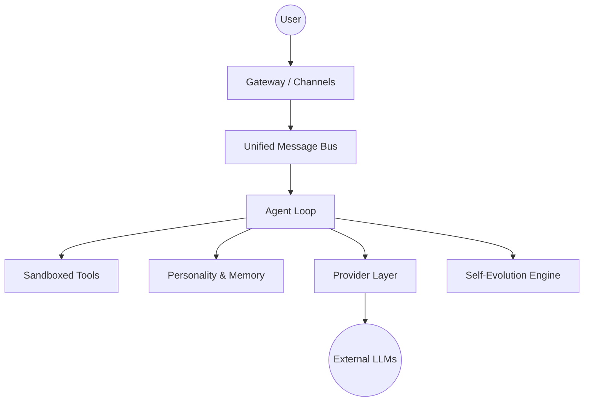

# MalikClaw Architecture Guide 🦅

🦅 **MalikClaw** is an ultra-lightweight personal AI Assistant built in Go, designed for efficiency, high performance, and autonomous self-evolution on anything from high-end servers to $10 edge devices.

---

## 🏗️ System Overview

MalikClaw follows a modular, layer-based architecture that decouples the user interface (Channels) from the reasoning logic (Agent Loop) and the model backend (Providers).

### 1. The Gateway (`pkg/channels`)
The Gateway is a unified messaging hub that manages connections to external platforms.
- **Protocol Normalization**: Translates Telegram, Discord, WhatsApp, and Web messages into a canonical internal format.
- **Zero-Footprint Webhooks**: Uses a single HTTP server to handle all inbound webhooks, significantly reducing idle RAM usage.
- **Media Handling**: Automatically processes and optimizes images/files for LLM consumption.

### 2. The Agent Loop (`pkg/agent`)
The core "orchestrator" of MalikClaw. It manages the lifecycle of a conversation.
- **Context Construction**: Combines `SOUL.md`, `IDENTITY.md`, and `MEMORY.md` with current time and session history to build a rich system prompt.
- **Unified Message Bus**: All communication happens over a Go-native, buffered channel system, ensuring thread safety and high throughput.
- **Tool Iteration**: Handles complex multi-step reasoning by allowing the agent to "think" and "act" multiple times before responding.

### 3. The Provider Layer (`pkg/providers`)
A protocol-agnostic abstraction for interacting with Large Language Models.
- **Protocol Support**: Native support for OpenAI-compatible, Anthropic-native, and Google Vertex/AntiGravity protocols.
- **Model-Centric Routing**: The `model_list` configuration allows for seamless switching between models without changing application code.
- **Smart Failover**: Automatically detects API failures and falls back to secondary models if configured.

### 4. Self-Evolution Engine (`Guardian`)
A unique feature that allows MalikClaw to improve itself.
- **Source Analysis**: The agent can read its own source code and configuration.
- **Autonomous Patching**: Using the `Guardian` engine, it can generate and apply diffs to its Go codebase to fix bugs or add small features.
- **Safety Boundary**: Self-evolution is strictly bounded to prevent destructive changes.

---

## 🛡️ Security & Sandboxing

Security is a foundational pillar of MalikClaw. We implement a **Sandboxed Execution Policy** across all tools:
- **Directory Jailing**: All file-system operations are restricted to the `workspace/` directory.
- **Command Filtering**: A regex-based safety layer blocks dangerous shell commands (e.g., privilege escalation, disk formatting).
- **Tool Approvals**: Sensitive tools require explicit configuration or environment flags to be enabled.

---

## 🧠 Personality-Driven Memory

MalikClaw stores its state in human-readable Markdown files, making it easy for users to inspect or edit their agent's "mind":
- **`SOUL.md`**: Core values, ethical boundaries, and behavioral tone.
- **`IDENTITY.md`**: Name, specialized skills, and self-described purpose.
- **`USER.md`**: User-specific data, preferences, and important facts to remember.
- **`MEMORY.md`**: Chronological log of key events and learned information.

---

## ⚡ Performance Optimization

MalikClaw is engineered for extreme efficiency:
- **Compiled Go**: Single static binary with minimal dependencies.
- **Context Caching**: Uses provider-specific caching (like Anthropic Context Caching) to reduce latency and costs.
- **Memory Management**: Optimized for low-RAM environments (functional on devices with as little as 256MB RAM).

---

## 🌍 Urdu-First Strategy

MalikClaw is the first agentic framework with native, first-class support for **Urdu**.
- **RTL Support**: Full support for Right-to-Left languages in the TUI and Web interface.
- **Bilingual Core**: Internal logic is optimized to handle mixed-language contexts seamlessly.

آگے بڑھو، ملک کلاؤ! (Go ahead, MalikClaw!)
