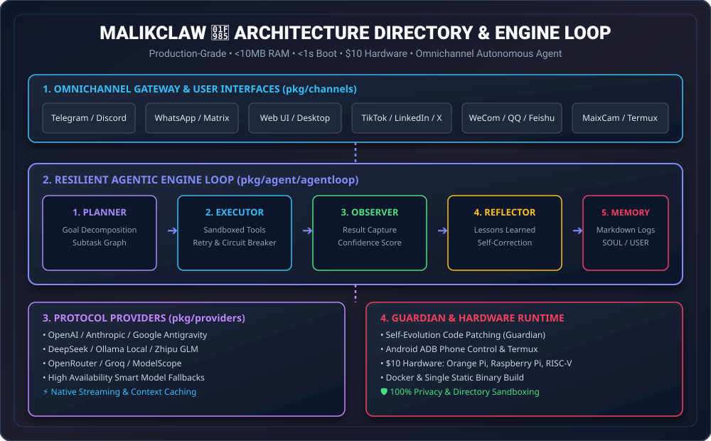
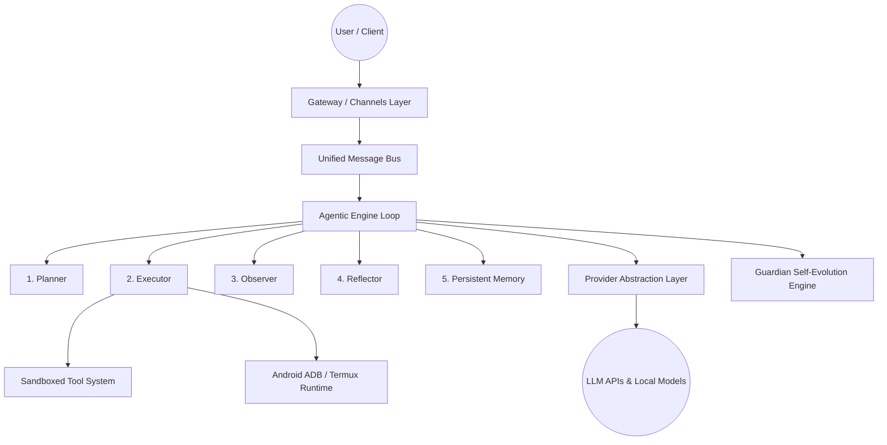

# MalikClaw Architecture Guide 🦅

🦅 **MalikClaw** is an ultra-lightweight, production-grade personal AI Assistant built in Go. It is engineered for extreme performance, low resource consumption (`<10MB` RAM, `<1s` boot time), and autonomous self-evolution across high-end servers down to $10 edge SBCs and Android devices.

---

## 🖼️ Architecture Overview Diagram

<div align="center">
  
</div>

---

## 🏗️ System Architecture

MalikClaw follows a modular, layered architecture that decouples user interfaces (Channels Gateway) from reasoning logic (Agentic Loop), provider backends (LLM Providers), and low-level hardware execution.


```mermaid
graph TD
    User((User / Client)) --> Channels[Gateway / Channels Layer]
    Channels --> Bus[Unified Message Bus]
    Bus --> Agent[Agentic Engine Loop]
    Agent --> Planner[1. Planner]
    Agent --> Executor[2. Executor]
    Agent --> Observer[3. Observer]
    Agent --> Reflector[4. Reflector]
    Agent --> Memory[5. Persistent Memory]
    Executor --> Tools[Sandboxed Tool System]
    Agent --> Providers[Provider Abstraction Layer]
    Providers --> ExternalLLMs((LLM APIs & Local Models))
    Agent --> Guardian[Guardian Self-Evolution Engine]
    Executor --> Mobile[Android ADB / Termux Runtime]
```

### 1. Omnichannel Gateway (`pkg/channels`)
The Gateway serves as a unified messaging hub managing concurrent connections across multi-platform channels:
- **Canonical Messaging Format**: Normalizes inbound messages from Telegram, Discord, WhatsApp, Matrix, TikTok, LinkedIn, Twitter/X, Reddit, WeCom, QQ, DingTalk, LINE, Feishu, MaixCam, and Slack into a standard internal event.
- **Zero-Footprint Webhooks**: A single HTTP server (listening on port 18790) routes inbound webhooks efficiently with minimal memory overhead.
- **Media Optimization**: Processes, compresses, and normalizes images and attachments for vision-capable models.

### 2. Production Agentic Engine Loop (`pkg/agent/agentloop`)
The heart of MalikClaw orchestrates reasoning via a resilient 5-stage loop:

```
PLAN ➔ ACT ➔ OBSERVE ➔ REFLECT ➔ MEMORY UPDATE
```

- **Planner (`pkg/agent/planner`)**: Decomposes complex user goals into structured subtask execution graphs.
- **Executor (`pkg/agent/executor`)**: Executes sandboxed tools with exponential backoff retries and circuit breaker protection.
- **Observer (`pkg/agent/observer`)**: Captures execution results, normalizes output schemas, and calculates confidence scores.
- **Reflector (`pkg/agent/reflector`)**: Evaluates task success/failure, extracts lessons learned, and triggers self-correction when needed.
- **Memory (`pkg/agent/memory`)**: Stores long-term episodic context, personality profiles, and search indexes in human-readable Markdown format.

### 3. Protocol-Agnostic Provider Layer (`pkg/providers`)
A flexible model interface handling multi-LLM routing, streaming, and context optimization:
- **Native Support**: Direct drivers for OpenAI, Anthropic (Native & Messages SDK), Google Gemini & Antigravity (Google Cloud Code Assist), DeepSeek, Ollama (Local), Groq, Zhipu GLM, OpenRouter, and ModelScope.
- **High-Availability Fallbacks**: Automatically routes around API rate limits or outages using configurable fallback chains (`model_list`).
- **Context Caching**: Employs prompt caching mechanisms (e.g. Anthropic Prompt Caching) to optimize speed and API costs.

### 4. Guardian Self-Evolution Engine (`pkg/agent/guardian`)
Enables MalikClaw to audit, debug, and autonomously patch its own source code:
- **Code Inspection**: The agent analyzes its own Go codebase, configurations, and logs.
- **Bounded Autonomous Patching**: Safely generates and applies targeted code diffs with built-in validation before execution.

---

## 🛡️ Security & Directory Sandboxing

Security is strictly enforced across all tool executions:
- **Directory Jailing**: File system access is restricted to the `workspace/` directory tree.
- **Command Sanitization**: Regex filtering blocks dangerous terminal commands (e.g. privilege escalation, raw partition formatting).
- **Explicit Approvals**: High-risk capabilities (shell access, system controls) require explicit configuration flags.

---

## 🧠 Markdown-First Memory System

MalikClaw maintains user context and state using plain Markdown files:
- **`SOUL.md`**: Core values, ethical boundaries, persona rules, and behavioral tone.
- **`IDENTITY.md`**: Assistant identity, name, capabilities, and purpose.
- **`USER.md`**: User preferences, background context, and persistent facts.
- **`MEMORY.md`**: Chronological log of key events, learned lessons, and conversation summaries.

---

## ⚡ Edge & Mobile Performance

- **Memory Efficiency**: Operates smoothly within `<10MB` RAM (up to 99% savings compared to heavy frameworks).
- **Fast Startup**: Sub-second boot times (`<1s`) even on low-frequency single-core processors (0.6GHz).
- **Mobile Runtime**: Direct Android control via ADB (tap, swipe, screenshot) and native headless execution on Termux.
- **Cross-Platform**: Zero-dependency Go binary built for `x86_64`, `ARM64`, `ARMv7`, `MIPS`, and `RISC-V`.

---

## 🌍 Multilingual & Urdu-First Strategy

- **Native RTL Support**: Full support for Right-to-Left languages (Urdu, Arabic) in terminal, TUI, and Web interfaces.
- **Global Locales**: Localized user interfaces in Urdu, English, Japanese, French, Portuguese, Vietnamese, and more.

آگے بڑھو، ملک کلاؤ! (Go ahead, MalikClaw!)

