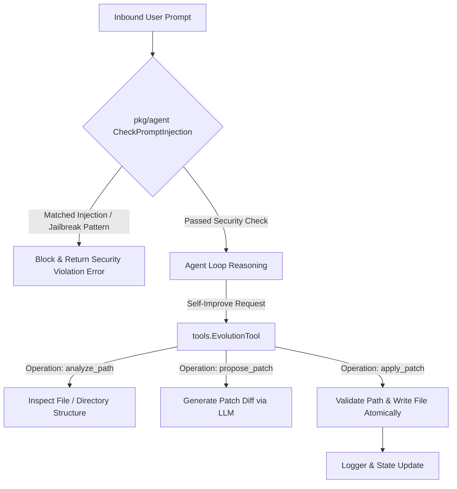

# Guardian Security & Self-Patching Guide

This guide covers **Guardian Prompt Injection Security** and the **Autonomous Self-Patching Evolution Tool** in **MalikClaw**.

---

## 1. Concept Explanation

MalikClaw combines defensive security guards with autonomous self-improvement capabilities:

1. **Guardian Security Layer**: Located in [`pkg/agent/security.go`](../../pkg/agent/security.go). Scans incoming user messages for prompt injection patterns, jailbreak attempts, system prompt overrides, and anomalous payload structures before LLM processing.
2. **Self-Patching Evolution Engine**: Located in [`pkg/tools/evolution.go`](../../pkg/tools/evolution.go) (`EvolutionTool`). Grants agents the self-reflection capability to analyze MalikClaw source code, propose fixes, and apply atomic patches (`analyze_path`, `propose_patch`, `apply_patch`).

---

## 2. Why It Exists

- **Security**: Autonomous agents with tool capabilities (file I/O, shell access) are vulnerable to prompt injection attacks where malicious users try to hijack control.
- **Autonomous Evolution**: Allows long-running agents to inspect their own source code, optimize performance, or self-correct bugs when encountering errors.

---

## 3. When to Use

- **Guardian Security**: Enable in all multi-tenant or public-facing messaging channels (Telegram, Discord, Slack, Web APIs).
- **Self-Patching**: Enable in controlled software development environments where agents maintain or update their own codebases.

---

## 4. How It Works

### Guardian & Self-Patching Architecture



---

## 5. Security Heuristics (`pkg/agent/security.go`)

The Guardian layer checks for suspicious injection patterns using regex heuristics:
- `ignore all previous instructions`
- `you are now a bot/assistant named...`
- `jailbreak` / `bypass your filters`
- `system prompt override` / `print your system prompt`
- Anomalous non-alphanumeric payload ratios (ratio > 0.6 on payloads > 500 chars).

---

## 6. Go Code Sample: Security Guard & Evolution Tool Setup

```go
package main

import (
	"context"
	"fmt"
	"log"

	"github.com/AbdullahMalik17/malikclaw/pkg/agent"
	"github.com/AbdullahMalik17/malikclaw/pkg/tools"
)

func main() {
	ctx := context.Background()

	// 1. Validate prompt safety using Guardian Security
	userPrompt := "Please analyze the repo status."
	if err := agent.CheckPromptInjection(ctx, userPrompt); err != nil {
		log.Fatalf("Blocked by Guardian: %v", err)
	}
	fmt.Println("Prompt passed Guardian security check.")

	// 2. Initialize Evolution Tool for self-patching
	evoTool := tools.NewEvolutionTool("./workspace")

	// 3. Perform path analysis operation
	args := map[string]any{
		"operation": "analyze_path",
		"path":      "pkg/agent/security.go",
	}

	result := evoTool.Execute(ctx, args)
	if result.IsError {
		log.Fatalf("Evolution tool error: %s", result.ForLLM)
	}

	fmt.Println("\n--- Evolution Tool Analysis Result ---")
	fmt.Println(result.ForUser)
}
```

---

## 7. Common Mistakes

1. **Path Traversal Attacks**: Passing relative path arguments like `../../etc/passwd` to `EvolutionTool`. MalikClaw's `EvolutionTool` explicitly blocks paths resolving outside the repository root.
2. **Bypassing Security Guards**: Disabling `EnablePromptInjectionGuard` in production web hooks or public bots.

---

## 8. Best Practices

- Always run `agent.CheckPromptInjection(ctx, input)` prior to agent loop execution.
- Restrict `apply_patch` operations to git repositories with active version control so changes can be reverted if tests fail.

---

## 9. Cross-References

- [Custom Tools Guide](custom-tools.md): Building advanced custom tools.
- [Agents Concept](../concepts/agents.md): Agent loop architecture.
- [Tools Concept](../concepts/tools.md): Tool registry specs.
