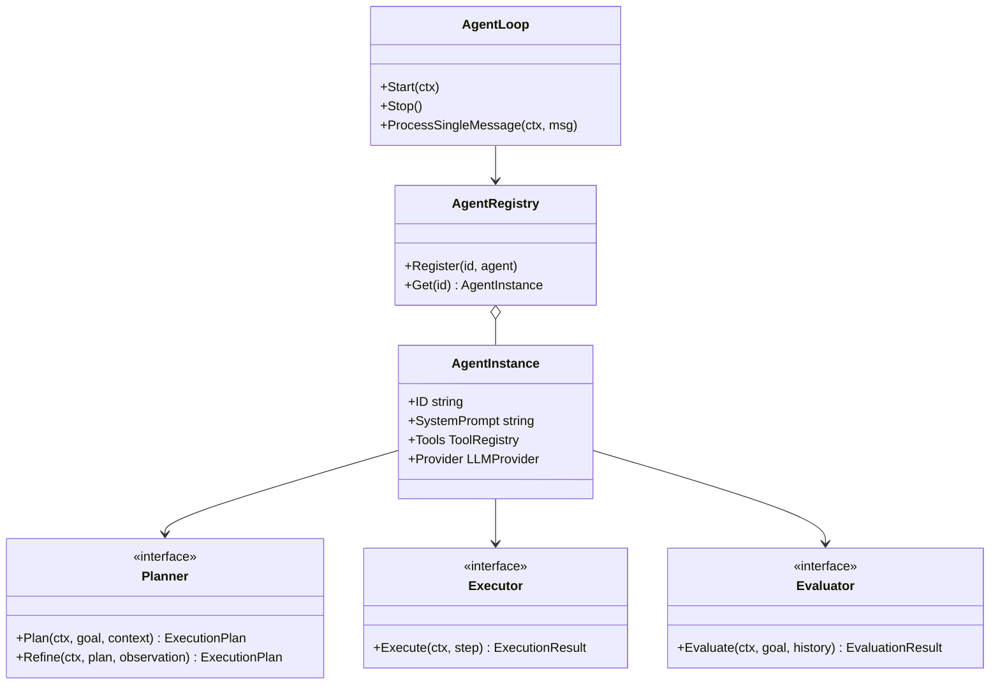

# Agent API Reference (`pkg/agent`)

This document provides detailed API specifications for the [`pkg/agent`](../../pkg/agent) package in MalikClaw.

---

## 1. Concept Explanation

The `pkg/agent` package contains the core autonomous loop, agent registry, security guards, and multi-agent supervisor abstractions.

---

## 2. Key Interfaces & Structs

### `AgentLoop`

The primary execution driver managing inbound message consumption and tool invocation.

```go
type AgentLoop struct {
	// unexported fields
}

func NewAgentLoop(
	cfg *config.Config,
	bus *bus.MessageBus,
	registry *AgentRegistry,
	tools *tools.ToolRegistry,
) *AgentLoop

func (a *AgentLoop) Start(ctx context.Context) error
func (a *AgentLoop) Stop() error
func (a *AgentLoop) ProcessSingleMessage(ctx context.Context, msg bus.InboundMessage) (*bus.OutboundMessage, error)
```

---

### `AgentInstance` & `AgentRegistry`

Represents a configured agent identity and manages instance lookups.

```go
type AgentInstance struct {
	ID           string
	SystemPrompt string
	Tools        *tools.ToolRegistry
	Provider     tools.LLMProvider
}

type AgentRegistry struct {
	// thread-safe lookup map
}

func NewAgentRegistry() *AgentRegistry
func (r *AgentRegistry) Register(id string, agent *AgentInstance)
func (r *AgentRegistry) Get(id string) (*AgentInstance, bool)
```

---

### Extension Interfaces (`Planner`, `Executor`, `Evaluator`, `Supervisor`)

Located in [`pkg/agent/interfaces.go`](../../pkg/agent/interfaces.go):

```go
type Planner interface {
	Plan(ctx context.Context, goal string, context []providers.Message) (*planner.ExecutionPlan, error)
	Refine(ctx context.Context, plan *planner.ExecutionPlan, observation string) (*planner.ExecutionPlan, error)
}

type Executor interface {
	Execute(ctx context.Context, step planner.EnhancedStep) (*executor.ExecutionResult, error)
}

type Evaluator interface {
	Evaluate(ctx context.Context, goal string, history []providers.Message) (*eval.EvaluationResult, error)
}

type Supervisor interface {
	Dispatch(ctx context.Context, goal string) (*SupervisorEpisode, error)
	Aggregate(ctx context.Context, episode *SupervisorEpisode, results map[string]string) (string, error)
}
```

---

### Security Guard Functions

Located in [`pkg/agent/security.go`](../../pkg/agent/security.go):

```go
type SecurityOptions struct {
	EnablePromptInjectionGuard bool
}

func CheckPromptInjection(ctx context.Context, message string) error
```

---

## 3. Component Diagram



---

## 4. Go Code Sample: Implementing a Custom Planner

```go
package main

import (
	"context"
	"fmt"

	"github.com/AbdullahMalik17/malikclaw/pkg/agent/planner"
	"github.com/AbdullahMalik17/malikclaw/pkg/providers"
)

// CustomPlanner implements agent.Planner
type CustomPlanner struct{}

func (p *CustomPlanner) Plan(ctx context.Context, goal string, history []providers.Message) (*planner.ExecutionPlan, error) {
	fmt.Printf("Planning for goal: %s\n", goal)
	return &planner.ExecutionPlan{
		Goal: goal,
		Steps: []planner.EnhancedStep{
			{ID: "step-1", Action: "analyze_requirements"},
			{ID: "step-2", Action: "generate_code"},
		},
	}, nil
}

func (p *CustomPlanner) Refine(ctx context.Context, plan *planner.ExecutionPlan, obs string) (*planner.ExecutionPlan, error) {
	fmt.Printf("Refining plan based on observation: %s\n", obs)
	return plan, nil
}
```

---

## 5. Common Mistakes

1. **Ignoring Prompt Security**: Omitting `agent.CheckPromptInjection` before passing raw user inputs to agents.
2. **Missing `ctx.Done()` Handling**: Failing to cancel long-running agent loops when HTTP request contexts disconnect.

---

## 6. Best Practices

- Use `AgentRegistry` to manage multiple agent identities cleanly.
- Set appropriate `MaxIterations` on `config.Config` to prevent infinite tool execution loops.

---

## 7. Cross-References

- [Agents Concept](../concepts/agents.md): Agent concept guide.
- [API Overview](overview.md): High-level package map.
- [Tools API](tools.md): Tool interface reference.
