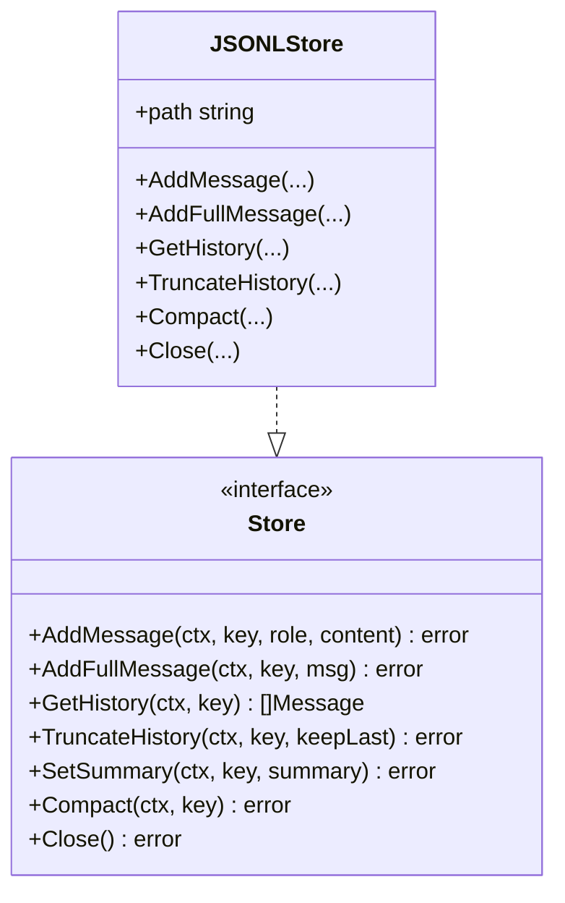

# Memory API Reference (`pkg/memory`)

This document provides detailed API specifications for the [`pkg/memory`](../../pkg/memory) package in MalikClaw.

---

## 1. Concept Explanation

The `pkg/memory` package provides persistent session storage through the `Store` interface ([`pkg/memory/store.go`](../../pkg/memory/store.go)) and file-based JSONL implementations ([`pkg/memory/jsonl.go`](../../pkg/memory/jsonl.go)).

---

## 2. Key Interfaces & Structs

### `Store` Interface

```go
type Store interface {
	AddMessage(ctx context.Context, sessionKey, role, content string) error
	AddFullMessage(ctx context.Context, sessionKey string, msg providers.Message) error
	GetHistory(ctx context.Context, sessionKey string) ([]providers.Message, error)
	GetSummary(ctx context.Context, sessionKey string) (string, error)
	SetSummary(ctx context.Context, sessionKey, summary string) error
	TruncateHistory(ctx context.Context, sessionKey string, keepLast int) error
	SetHistory(ctx context.Context, sessionKey string, history []providers.Message) error
	Compact(ctx context.Context, sessionKey string) error
	Close() error
}
```

---

### `JSONLStore`

```go
type JSONLStore struct {
	// unexported fields
}

func NewJSONLStore(path string) (*JSONLStore, error)
func (s *JSONLStore) AddMessage(ctx context.Context, sessionKey, role, content string) error
func (s *JSONLStore) AddFullMessage(ctx context.Context, sessionKey string, msg providers.Message) error
func (s *JSONLStore) GetHistory(ctx context.Context, sessionKey string) ([]providers.Message, error)
func (s *JSONLStore) TruncateHistory(ctx context.Context, sessionKey string, keepLast int) error
func (s *JSONLStore) Compact(ctx context.Context, sessionKey string) error
func (s *JSONLStore) Close() error
```

---

## 3. Storage Architecture Diagram



---

## 4. Go Code Sample: Session Management & Compaction

```go
package main

import (
	"context"
	"fmt"
	"log"

	"github.com/AbdullahMalik17/malikclaw/pkg/memory"
	"github.com/AbdullahMalik17/malikclaw/pkg/providers"
)

func main() {
	ctx := context.Background()

	// 1. Initialize store
	store, err := memory.NewJSONLStore("./workspace/sessions.jsonl")
	if err != nil {
		log.Fatalf("Failed to initialize JSONL store: %v", err)
	}
	defer store.Close()

	sessionKey := "telegram:chat-88"

	// 2. Add full structured messages
	_ = store.AddFullMessage(ctx, sessionKey, providers.Message{
		Role:    "user",
		Content: "Summarize Go 1.22 release notes.",
	})
	_ = store.AddFullMessage(ctx, sessionKey, providers.Message{
		Role:    "assistant",
		Content: "Go 1.22 introduces enhanced routing and range over integers.",
	})

	// 3. Truncate history to keep only last 1 message
	err = store.TruncateHistory(ctx, sessionKey, 1)
	if err != nil {
		log.Fatalf("Truncation failed: %v", err)
	}

	// 4. Compact log storage
	_ = store.Compact(ctx, sessionKey)

	// 5. Fetch updated history
	history, _ := store.GetHistory(ctx, sessionKey)
	fmt.Printf("Remaining history items: %d\n", len(history))
}
```

---

## 5. Common Mistakes

1. **Unclosed File Descriptors**: Creating multiple `JSONLStore` instances without calling `.Close()`.
2. **Hardcoded Windows Path Backslashes in Session Keys**: Using raw file paths as session keys instead of clean channel identifiers.

---

## 6. Best Practices

- Periodically run `Compact(ctx, sessionKey)` on long-running session stores to reclaim disk space.
- Always check returned errors from `AddFullMessage` and `SetHistory`.

---

## 7. Cross-References

- [Memory Concept](../concepts/memory.md): Concept guide for short-term and long-term memory.
- [API Overview](overview.md): High-level package map.
- [Agent API](agent.md): Agent loop memory integration.
