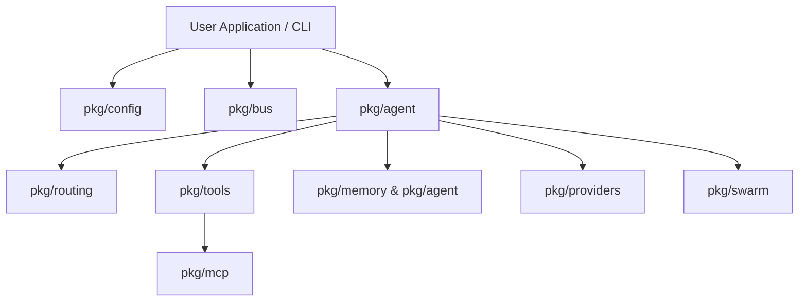

# API Reference Overview

Welcome to the **MalikClaw** Go API reference. This document provides a high-level overview of the main packages, interfaces, and architecture of the MalikClaw agent engine.

---

## 1. Concept Explanation

MalikClaw is built as a set of decoupled, modular Go packages located under [`pkg/`](../../pkg). Developers can use MalikClaw as a complete standalone CLI/daemon application or import individual packages into their own Go microservices.

---

## 2. Package Architecture Map

```
pkg/
├── agent/       # AgentLoop, AgentInstance, Planner, Executor, Evaluator, Security
├── tools/       # Tool interface, ToolRegistry, built-in tools (FS, Shell, Web, MCP)
├── memory/      # Persistent Store interface, JSONL/SQLite backends, compaction
├── providers/   # LLMProvider interface, OpenAI, Anthropic, Gemini, Ollama, FallbackChain
├── routing/     # Task Router, Classifier, ProviderProfile, AgentID mapping
├── bus/         # MessageBus pub/sub event system for inbound/outbound messages
├── mcp/         # Model Context Protocol manager, stdio/SSE client transports
├── swarm/       # Peer-to-peer node network and remote task dispatching
├── config/      # Configuration loading, validation, YAML/env parsing
├── commands/    # CLI slash-commands registry and execution
├── channels/    # Messaging channel connectors (Telegram, Discord, Slack, Feishu)
└── logger/      # Contextual structured logging
```

---

## 3. Package Dependency & Interaction Graph



---

## 4. Key Core Packages

| Package | Primary Exported Types / Interfaces | Purpose |
| :--- | :--- | :--- |
| **`pkg/agent`** | `AgentLoop`, `AgentInstance`, `Planner`, `Executor`, `Evaluator`, `Supervisor` | Core autonomous reasoning loop & multi-agent management |
| **`pkg/tools`** | `Tool`, `AsyncExecutor`, `ToolRegistry`, `ToolResult` | Extensible tool definitions, schema generation, & execution |
| **`pkg/memory`** | `Store`, `JSONLStore`, `MemoryStore` | Session conversation persistence & long-term markdown memory |
| **`pkg/providers`** | `LLMProvider`, `FallbackChain`, `Message`, `LLMResponse` | Unified multi-vendor LLM provider client layer |
| **`pkg/routing`** | `Router`, `Classifier`, `ProviderProfile` | Smart model selection & task categorization |
| **`pkg/mcp`** | `Manager`, `MCPServerConfig` | Model Context Protocol server discovery and dynamic wrapping |
| **`pkg/bus`** | `MessageBus`, `InboundMessage`, `OutboundMessage` | Async channel event bus |

---

## 5. Go Code Sample: Initializing Core Subsystems

```go
package main

import (
	"context"
	"fmt"
	"log"

	"github.com/AbdullahMalik17/malikclaw/pkg/agent"
	"github.com/AbdullahMalik17/malikclaw/pkg/bus"
	"github.com/AbdullahMalik17/malikclaw/pkg/config"
	"github.com/AbdullahMalik17/malikclaw/pkg/tools"
)

func main() {
	_ = context.Background()

	// 1. Load config
	cfg := config.DefaultConfig()

	// 2. Instantiate Message Bus
	msgBus := bus.NewMessageBus()

	// 3. Setup Tool Registry
	toolReg := tools.NewToolRegistry()
	toolReg.Register(tools.NewFileSystemTool("./workspace"))

	// 4. Setup Agent Registry & Loop
	agentReg := agent.NewAgentRegistry()
	loop := agent.NewAgentLoop(cfg, msgBus, agentReg, toolReg)

	fmt.Printf("MalikClaw API subsystems initialized. Running state: %v\n", loop != nil)
}
```

---

## 6. Common Mistakes

1. **Importing Internal Utilities Directly**: Importing non-exported types or unstable internal functions instead of public package APIs in `pkg/`.
2. **Ignoring Package Context Cancellation**: Not propagating `context.Context` through package calls like `provider.Chat` or `tool.Execute`.

---

## 7. Best Practices

- Import packages cleanly via `github.com/AbdullahMalik17/malikclaw/pkg/...`.
- Pass context values explicitly through all function calls.
- Initialize `config.Config` using `config.LoadConfig()` or `config.DefaultConfig()` before constructing subsystems.

---

## 8. Cross-References

- [Agent API Reference](agent.md): Deep dive into `pkg/agent`.
- [Tools API Reference](tools.md): Deep dive into `pkg/tools`.
- [Memory API Reference](memory.md): Deep dive into `pkg/memory`.
