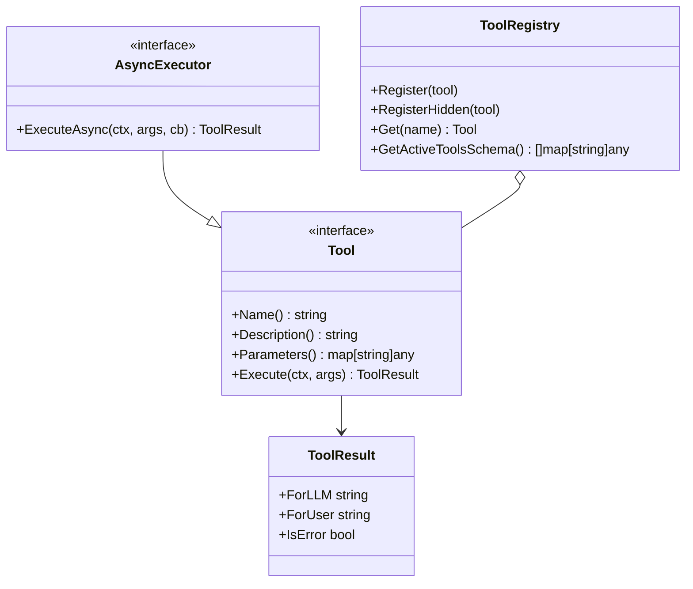

# Tools API Reference (`pkg/tools`)

This document provides detailed API specifications for the [`pkg/tools`](../../pkg/tools) package in MalikClaw.

---

## 1. Concept Explanation

The `pkg/tools` package defines the core `Tool` interface, `AsyncExecutor` interface, request-scoped context helpers, and thread-safe `ToolRegistry`.

---

## 2. Key Interfaces & Structs

### `Tool` Interface

Defined in [`pkg/tools/base.go`](../../pkg/tools/base.go):

```go
type Tool interface {
	Name() string
	Description() string
	Parameters() map[string]any
	Execute(ctx context.Context, args map[string]any) *ToolResult
}
```

---

### `AsyncExecutor` & `AsyncCallback`

```go
type AsyncCallback func(ctx context.Context, result *ToolResult)

type AsyncExecutor interface {
	Tool
	ExecuteAsync(ctx context.Context, args map[string]any, cb AsyncCallback) *ToolResult
}
```

---

### `ToolResult`

```go
type ToolResult struct {
	ForLLM  string `json:"for_llm"`
	ForUser string `json:"for_user"`
	IsError bool   `json:"is_error"`
}

func ErrorResult(msg string) *ToolResult
func AsyncResult(msg string) *ToolResult
```

---

### `ToolRegistry`

Defined in [`pkg/tools/registry.go`](../../pkg/tools/registry.go):

```go
type ToolRegistry struct {
	// unexported fields
}

func NewToolRegistry() *ToolRegistry
func (r *ToolRegistry) Register(tool Tool)
func (r *ToolRegistry) RegisterHidden(tool Tool)
func (r *ToolRegistry) Get(name string) (Tool, bool)
func (r *ToolRegistry) GetTools() map[string]Tool
func (r *ToolRegistry) GetActiveToolsSchema() []map[string]any
```

---

### Request-Scoped Context Helpers

```go
func WithToolContext(ctx context.Context, channel, chatID string) context.Context
func ToolChannel(ctx context.Context) string
func ToolChatID(ctx context.Context) string
```

---

## 3. Class & Method Diagram



---

## 4. Go Code Sample: Inspecting Registered Tool Schemas

```go
package main

import (
	"encoding/json"
	"fmt"

	"github.com/AbdullahMalik17/malikclaw/pkg/tools"
)

func main() {
	registry := tools.NewToolRegistry()
	registry.Register(tools.NewFileSystemTool("./workspace"))

	// Retrieve active schemas formatted for LLM provider consumption
	schemas := registry.GetActiveToolsSchema()

	jsonBytes, _ := json.MarshalIndent(schemas, "", "  ")
	fmt.Printf("Registered Tools Schema:\n%s\n", string(jsonBytes))
}
```

---

## 5. Common Mistakes

1. **Ill-formed Parameter Map**: Returning non-standard JSON schema structures in `Parameters()`.
2. **Accessing Context Keys Directly**: Hardcoding context string keys instead of calling `tools.ToolChannel(ctx)` or `tools.ToolChatID(ctx)`.

---

## 6. Best Practices

- Use `tools.ToolToSchema(tool)` to quickly convert any `Tool` instance to OpenAI-compatible tool JSON schema maps.
- Use `tools.ErrorResult(msg)` for expected failures (file not found, division by zero) so the LLM can recover gracefully.

---

## 7. Cross-References

- [Tools Concept](../concepts/tools.md): Core concept guide.
- [Custom Tools Guide](../advanced/custom-tools.md): How to build advanced custom tools.
- [API Overview](overview.md): High-level package map.
