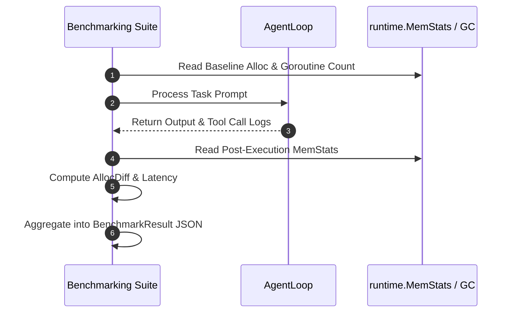

# Benchmark Methodology

This document outlines the benchmarking methodology, metrics framework, and evaluation criteria used in **MalikClaw**.

---

## 1. Concept Explanation

MalikClaw includes a native agent benchmarking engine located in [`pkg/agent/benchmarks/benchmark.go`](../../pkg/agent/benchmarks/benchmark.go). It captures execution duration, heap memory allocation changes (`alloc_diff_bytes`), token usage, tool invocation counts, and goroutine counts per task episode.

---

## 2. Why It Exists

Measuring LLM agent performance requires tracking non-deterministic dimensions:
- **Resource Footprint**: RSS memory usage and heap allocations per turn.
- **Execution Speed**: Time-to-first-token (TTFT) and total task completion latency.
- **Task Success & Accuracy**: Correct tool invocations and output evaluations.
- **Cost Efficiency**: Token consumption per completed task.

---

## 3. When to Use

- When comparing performance between different LLM providers (e.g. OpenAI vs Anthropic vs DeepSeek vs Ollama).
- When regression testing new tools or system prompts.
- When optimizing memory utilization on resource-constrained embedded systems.

---

## 4. How It Works

The benchmarking pipeline uses `ExecutionMetrics` and `BenchmarkResult` structs:

### Metric Collection Sequence Diagram



---

## 5. Primary Tracked Metrics

| Metric | Field | Description |
| :--- | :--- | :--- |
| **Success Rate** | `SuccessRate` | Percentage of tasks completed without errors or step limits |
| **Average Duration** | `AverageDuration` | Mean time from task dispatch to final response |
| **Token Efficiency** | `AverageTokenCount` | Mean total tokens consumed per task |
| **Tool Calling Ratio** | `AverageToolCalls` | Mean number of tool invocations per task |
| **Memory Allocation Diff**| `AllocDiff` | Heap memory allocated during task execution (in bytes) |
| **Goroutine Leak Count** | `NumGoroutines` | Active goroutines after task completion |

---

## 6. Go Code Sample: Running Benchmarks Programmatically

```go
package main

import (
	"context"
	"fmt"
	"log"
	"time"

	"github.com/AbdullahMalik17/malikclaw/pkg/agent/benchmarks"
)

func main() {
	ctx := context.Background()

	// 1. Initialize Benchmark suite
	suite := benchmarks.NewBenchmark("./workspace/benchmarks")

	// 2. Define test task execution closure
	taskFunc := func(ctx context.Context) (*benchmarks.ExecutionMetrics, error) {
		start := time.Now()
		
		// Simulate agent task turn
		time.Sleep(150 * time.Millisecond)

		return &benchmarks.ExecutionMetrics{
			TaskID:       "bench-task-001",
			StartTime:    start,
			EndTime:      time.Now(),
			Duration:     150 * time.Millisecond,
			MessageCount: 4,
			TokenCount:   320,
			ToolCalls:    2,
			Success:      true,
		}, nil
	}

	// 3. Run benchmark for 5 iterations
	result, err := suite.RunBenchmark(ctx, "tool-invocation-suite", 5, taskFunc)
	if err != nil {
		log.Fatalf("Benchmark failed: %v", err)
	}

	// 4. Print aggregated metrics
	fmt.Println("================ Benchmark Results ================")
	fmt.Printf("Total Executions: %d\n", result.TotalExecutions)
	fmt.Printf("Success Rate:     %.2f%%\n", result.SuccessRate*100)
	fmt.Printf("Average Duration: %v\n", result.AverageDuration)
	fmt.Printf("Average Tokens:   %.1f\n", result.AverageTokenCount)
	fmt.Println("==================================================")
}
```

---

## 7. Common Mistakes

1. **Not Forcing GC Before Measurement**: Measuring memory allocations without triggering `runtime.GC()` prior to task execution leads to noisy `AllocDiff` figures.
2. **Small Sample Sizes**: Running single-iteration benchmarks that fail to account for cloud API network jitter.

---

## 8. Best Practices

- Run benchmark suites across a minimum of 5–10 iterations.
- Run benchmarks in isolated network environments to minimize latency skew.
- Export results to JSON for CI/CD regression tracking.

---

## 9. Cross-References

- [Benchmark Results](results.md): Current benchmark performance figures.
- [Agents Concept](../concepts/agents.md): Agent architecture details.
