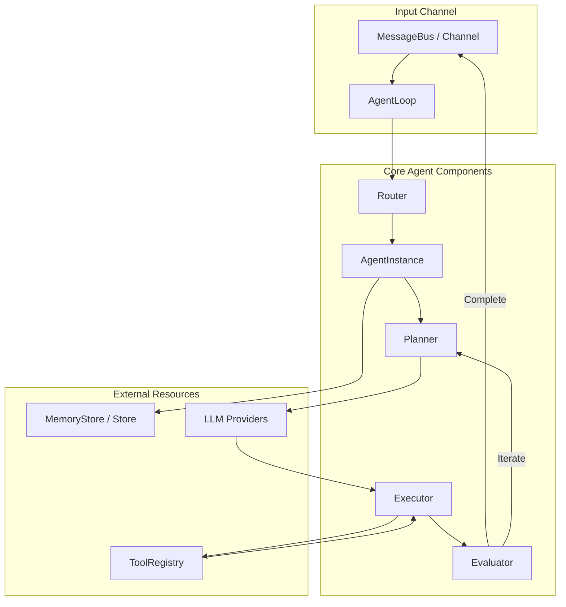

# Agents Core Concept

This document explains the architecture, lifecycle, and design principles of **Agents** in MalikClaw.

---

## 1. Concept Explanation

An **Agent** in MalikClaw is an autonomous software entity that accepts goals or messages, plans execution steps, invokes external tools, maintains conversation history, and evaluates whether a objective has been met.

In MalikClaw, agents are defined through the [`pkg/agent`](../../pkg/agent) package, centered around `AgentLoop`, `AgentInstance`, and structured interfaces (`Planner`, `Executor`, `Evaluator`).

---

## 2. Why It Exists

Raw LLM APIs are stateless text-in/text-out interfaces. To perform non-trivial autonomous tasks—such as editing local files, executing shell scripts, querying web APIs, or orchestrating multi-step workflows—an application needs a persistent control loop that connects model responses to tool execution and state tracking.

---

## 3. When to Use

- When building interactive conversational assistants across messaging channels.
- When delegating multi-step automated software engineering, file processing, or system administration tasks.
- When creating multi-agent swarms with supervisor-subagent delegation.

---

## 4. How It Works

MalikClaw agents operate on an **Observe-Plan-Execute-Evaluate** loop:

1. **Observe**: The agent receives an inbound message or system trigger via `bus.MessageBus`.
2. **Plan**: The `Planner` component constructs or refines an `ExecutionPlan`.
3. **Execute**: The `Executor` executes tool calls specified by the plan or model response.
4. **Evaluate**: The `Evaluator` checks output accuracy against task constraints. If complete, a final response is returned; otherwise, the loop iterates.

### Agent Architecture Diagram



---

## 5. Go Code Sample: Creating and Customizing an Agent

```go
package main

import (
	"context"
	"fmt"
	"log"
	"time"

	"github.com/AbdullahMalik17/malikclaw/pkg/agent"
	"github.com/AbdullahMalik17/malikclaw/pkg/bus"
	"github.com/AbdullahMalik17/malikclaw/pkg/config"
	"github.com/AbdullahMalik17/malikclaw/pkg/providers"
	"github.com/AbdullahMalik17/malikclaw/pkg/tools"
)

func main() {
	ctx := context.Background()

	// 1. Setup config & dependencies
	cfg := config.DefaultConfig()
	cfg.Agent.MaxIterations = 10

	messageBus := bus.NewMessageBus()
	toolRegistry := tools.NewToolRegistry()
	agentRegistry := agent.NewAgentRegistry()

	// Register core tools
	toolRegistry.Register(tools.NewFileSystemTool("./workspace"))

	// 2. Initialize AgentLoop
	agentLoop := agent.NewAgentLoop(cfg, messageBus, agentRegistry, toolRegistry)

	// 3. Register custom system instructions and agent instance
	instance := &agent.AgentInstance{
		ID:           "coding-assistant",
		SystemPrompt: "You are an expert Go software engineer.",
		Tools:        toolRegistry,
		Provider:     providers.NewOpenAIProvider("sk-key", "gpt-4o-mini", ""),
	}
	agentRegistry.Register("coding-assistant", instance)

	// 4. Dispatch a message
	msg := bus.InboundMessage{
		ID:        "task-1",
		Channel:   "cli",
		ChatID:    "session-101",
		Content:   "Write a Go function to check if a number is prime.",
		Timestamp: time.Now(),
	}

	result, err := agentLoop.ProcessSingleMessage(ctx, msg)
	if err != nil {
		log.Fatalf("Agent failed: %v", err)
	}

	fmt.Printf("Agent Result:\n%s\n", result.Content)
}
```

---

## 6. Common Mistakes

1. **Unbounded Iterations**: Not setting `cfg.Agent.MaxIterations`, leading to endless tool loops when model outputs stall.
2. **Shared Mutable State**: Sharing agent instance state across concurrent sessions without mutex synchronization or isolated memory stores.
3. **Ignoring Prompt Injection Guards**: Failing to sanitize user inputs before feeding them into system prompts.

---

## 7. Best Practices

- Always specify `MaxIterations` (typically 10–20 steps).
- Clean up inactive sessions in `AgentRegistry` to avoid memory bloat.
- Isolate workspace paths per session when executing file or shell tools.

---

## 8. Cross-References

- [Tools Concept](tools.md): Tool registration and execution details.
- [Memory Concept](memory.md): Long-term memory and session persistence.
- [Routing Concept](routing.md): Dynamic model routing and agent selection.
- [Agent API Overview](../api/agent.md): Direct Go package reference.
