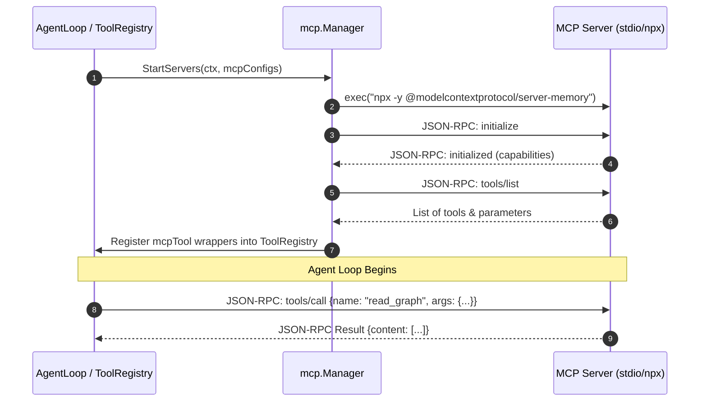

# Model Context Protocol (MCP) Core Concept

This document details how **MalikClaw** implements the **Model Context Protocol (MCP)** to connect agents with external tool servers and context providers.

---

## 1. Concept Explanation

The **Model Context Protocol (MCP)** is an open standard created by Anthropic that standardizes how applications provide context and tools to LLMs. MalikClaw features a built-in MCP Client Manager ([`pkg/mcp/manager.go`](../../pkg/mcp/manager.go)) that connects to local stdio-based MCP servers or remote HTTP/SSE MCP servers, dynamically converting remote MCP tools into standard MalikClaw [`tools.Tool`](tools.md) instances.

---

## 2. Why It Exists

Before MCP, integrating every third-party service (PostgreSQL, GitHub, Brave Search, File System, Google Drive) required building custom Go tools. MCP allows MalikClaw agents to instantly consume hundreds of existing open-source MCP server integrations without writing custom tool code.

---

## 3. When to Use

- When connecting your agent to existing official MCP servers (e.g., `@modelcontextprotocol/server-github`, `@modelcontextprotocol/server-filesystem`).
- When exposing existing enterprise services via standard MCP JSON-RPC endpoints.
- When isolating dangerous or heavy dependencies inside separate subprocess containers.

---

## 4. How It Works

1. **Server Discovery & Transport**: MalikClaw starts the target MCP server subprocess (via `stdio`) or connects over HTTP/SSE.
2. **Protocol Handshake**: Initializes the JSON-RPC handshake (`initialize` request) and negotiates capabilities.
3. **Tool Listing**: Sends `tools/list` to discover exposed functions and their JSON schemas.
4. **Registration**: Wraps each discovered MCP function in an `mcpTool` struct that implements `tools.Tool`, registering it with `ToolRegistry`.
5. **Execution**: When the LLM invokes the tool, MalikClaw converts the arguments into a `tools/call` JSON-RPC message and returns the output to the agent loop.

### MCP Handshake & Execution Diagram



---

## 5. Configuration Example (`config.yaml`)

```yaml
mcp:
  enabled: true
  servers:
    filesystem:
      command: "npx"
      args:
        - "-y"
        - "@modelcontextprotocol/server-filesystem"
        - "/Users/developer/projects"
      env:
        NODE_ENV: "production"
    github:
      command: "npx"
      args:
        - "-y"
        - "@modelcontextprotocol/server-github"
      env:
        GITHUB_PERSONAL_ACCESS_TOKEN: "ghp_xxxxxxxxxxxx"
```

---

## 6. Go Code Sample: Initializing MCP Manager Programmatically

```go
package main

import (
	"context"
	"fmt"
	"log"
	"time"

	"github.com/AbdullahMalik17/malikclaw/pkg/config"
	"github.com/AbdullahMalik17/malikclaw/pkg/mcp"
	"github.com/AbdullahMalik17/malikclaw/pkg/tools"
)

func main() {
	ctx, cancel := context.WithTimeout(context.Background(), 15*time.Second)
	defer cancel()

	// 1. Define MCP server configuration
	mcpConfig := map[string]config.MCPServerConfig{
		"memory-server": {
			Command: "npx",
			Args:    []string{"-y", "@modelcontextprotocol/server-memory"},
		},
	}

	// 2. Initialize Tool Registry and MCP Manager
	toolRegistry := tools.NewToolRegistry()
	manager := mcp.NewManager()

	// 3. Start MCP servers and register tools dynamically
	err := manager.StartServers(ctx, mcpConfig, toolRegistry)
	if err != nil {
		log.Fatalf("Failed to start MCP servers: %v", err)
	}
	defer manager.StopAll()

	// 4. Verify registered tools
	for name := range toolRegistry.GetTools() {
		fmt.Printf("Registered Tool (includes MCP): %s\n", name)
	}
}
```

---

## 7. Common Mistakes

1. **Missing Runtime Binaries**: Attempting to run `npx` or `uvx` servers without having Node.js/npm or Python installed on the host system PATH.
2. **Blocking Stderr Pipelines**: Ignoring process stderr logs, causing the stdio transport to hang when an MCP server writes error messages.
3. **Missing Environment Variables**: Forgetting to pass API tokens (like `GITHUB_PERSONAL_ACCESS_TOKEN`) in `MCPServerConfig.Env`.

---

## 8. Best Practices

- Always invoke `manager.StopAll()` during application shutdown to terminate background MCP subprocesses cleanly.
- Use explicit timeouts when initializing MCP servers.
- Sandbox stdio MCP servers inside minimal Docker containers when running untrusted third-party code.

---

## 9. Cross-References

- [Tools Concept](tools.md): Tool interface and registry architecture.
- [MCP Server Example](../examples/mcp-server.md): Step-by-step example running an MCP server.
- [Agents Concept](agents.md): How agents use MCP tools.
