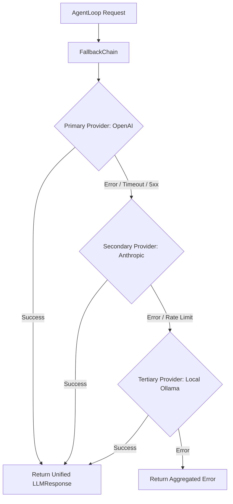

# LLM Providers Core Concept

This document explains the unified **LLM Provider** abstraction and fallback mechanism in **MalikClaw**.

---

## 1. Concept Explanation

MalikClaw decouples agent execution from specific AI vendors using a unified provider interface defined in [`pkg/providers`](../../pkg/providers).

Supported out of the box:
- **OpenAI** (`gpt-4o`, `gpt-4o-mini`, `o1`, `o3-mini`)
- **Anthropic** (`claude-3-5-sonnet`, `claude-3-5-haiku`)
- **Google Gemini** (`gemini-1.5-pro`, `gemini-2.0-flash`)
- **DeepSeek** (`deepseek-chat`, `deepseek-coder`, `deepseek-r1`)
- **Ollama** (Local models: `llama3`, `qwen2.5-coder`, `mistral`)
- **Groq**, **Together AI**, and arbitrary **OpenAI-Compatible** HTTP APIs.

---

## 2. Why It Exists

Every AI provider uses different JSON request payloads, headers, tool-calling formats, error responses, and streaming chunk protocols. `pkg/providers` normalizes these differences so agents, memory engines, and tool registries interact with a single invariant Go interface.

---

## 3. When to Use

- When building multi-cloud or vendor-agnostic AI applications.
- When enabling fallback redundancy across cloud providers.
- When running local open-source LLMs alongside cloud APIs for privacy or offline execution.

---

## 4. How It Works

The core interface is [`tools.LLMProvider`](../../pkg/tools/types.go):

```go
type LLMProvider interface {
	Chat(
		ctx context.Context,
		messages []Message,
		tools []ToolDefinition,
		model string,
		options map[string]any,
	) (*LLMResponse, error)
	GetDefaultModel() string
}
```

### Provider Architecture & Fallback Flow



---

## 5. Go Code Sample: FallbackChain Setup

```go
package main

import (
	"context"
	"fmt"
	"log"
	"time"

	"github.com/AbdullahMalik17/malikclaw/pkg/providers"
)

func main() {
	ctx, cancel := context.WithTimeout(context.Background(), 20*time.Second)
	defer cancel()

	// 1. Initialize individual providers
	openaiProv := providers.NewOpenAIProvider("sk-openai-key", "gpt-4o-mini", "")
	anthropicProv := providers.NewAnthropicProvider("sk-ant-key", "claude-3-5-haiku-20241022", "")
	ollamaProv := providers.NewOllamaProvider("http://localhost:11434", "llama3:latest")

	// 2. Create FallbackChain
	chain := providers.NewFallbackChain(openaiProv)
	chain.AddFallback(anthropicProv)
	chain.AddFallback(ollamaProv)

	// 3. Execute Chat call with automatic failover
	messages := []providers.Message{
		{Role: "user", Content: "Explain concurrency in Go in two sentences."},
	}

	resp, err := chain.Chat(ctx, messages, nil, "", nil)
	if err != nil {
		log.Fatalf("All providers failed: %v", err)
	}

	fmt.Printf("Response: %s\n", resp.Content)
}
```

---

## 6. Common Mistakes

1. **Hardcoding Provider-Specific Enums**: Relying on raw string keys specific to one provider inside tool logic rather than using normalized `providers.Message` structs.
2. **Missing Rate-Limit Handling**: Failing to register secondary providers in `FallbackChain`, causing agent failure when a single cloud API hits HTTP 429 rate limits.
3. **Invalid Ollama Endpoint**: Pointing Ollama provider to `http://localhost:11434/v1` instead of `http://localhost:11434`.

---

## 7. Best Practices

- Always configure at least one local or secondary cloud fallback in production environments.
- Use `options["temperature"]` and `options["max_tokens"]` for fine-grained generation tuning.
- Monitor `resp.Usage` to keep track of total token expenditure across different providers.

---

## 8. Cross-References

- [Routing Concept](routing.md): Dynamic selection of provider profiles based on task complexity.
- [Configuration Guide](../getting-started/configuration.md): Setting API keys via environment variables and YAML.
- [Agents Concept](agents.md): Integration of providers into `AgentLoop`.
