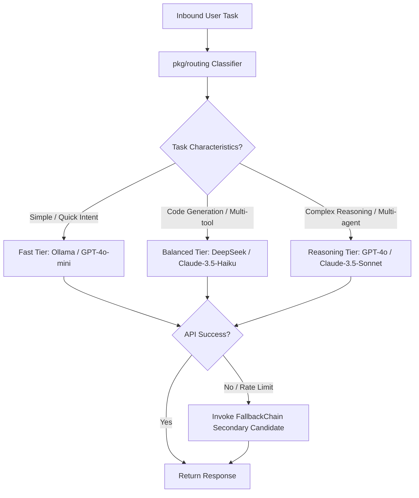

# Task Routing & Model Selector Core Concept

This document explains the dynamic task routing, agent selection, and cost-optimization model in **MalikClaw**.

---

## 1. Concept Explanation

The **Routing** system in MalikClaw ([`pkg/routing`](../../pkg/routing)) analyzes incoming user requests, extracts task feature vectors (complexity, required tools, token length, urgency), and routes them to the optimal LLM provider profile (`ProviderProfile`) or specialized subagent (`AgentID`).

---

## 2. Why It Exists

Not all user queries require top-tier flagship LLMs (like GPT-4o or Claude 3.5 Sonnet). Simple intent classification, status checks, or basic text formatting can be handled by fast, low-cost local models (e.g., Ollama / Llama 3) or mini models (GPT-4o-mini), saving up to 90% in token costs while maintaining sub-second latency.

---

## 3. When to Use

- High-throughput production deployments with diverse request workloads.
- Systems utilizing hybrid cloud/local deployments (e.g., local Ollama for privacy-sensitive steps, cloud APIs for deep reasoning).
- Applications with fallback requirements when primary LLM endpoints experience rate-limiting or outages.

---

## 4. How It Works

1. **Feature Extraction**: `Classifier` examines prompt length, tool requirements, code blocks, and intent patterns.
2. **Profile Matching**: Checks registered `ProviderProfile` options against task requirements.
3. **Route Selection**: Assigns the request to the most cost-effective candidate that meets capability requirements.
4. **Fallback Chain Execution**: If the selected provider returns a 5xx error or rate limit, `FallbackChain` automatically retries with the next candidate in line.

### Routing Decision Tree Diagram



---

## 5. Go Code Sample: Task Classification & Routing

```go
package main

import (
	"context"
	"fmt"
	"log"

	"github.com/AbdullahMalik17/malikclaw/pkg/providers"
	"github.com/AbdullahMalik17/malikclaw/pkg/routing"
)

func main() {
	ctx := context.Background()

	// 1. Initialize profiles
	profiles := map[string]*routing.ProviderProfile{
		"fast": {
			Name:       "fast-tier",
			Provider:   "openai",
			Model:      "gpt-4o-mini",
			MaxTokens:  2048,
			CostFactor: 0.1,
		},
		"heavy": {
			Name:       "heavy-tier",
			Provider:   "anthropic",
			Model:      "claude-3-5-sonnet-20241022",
			MaxTokens:  8192,
			CostFactor: 1.0,
		},
	}

	// 2. Initialize Router
	router := routing.NewRouter(profiles, "fast")

	// 3. Route different task types
	simpleTask := "What is the capital of France?"
	complexTask := "Architect a distributed consensus protocol in Go with leader election and Raft log replication."

	candidateSimple, err := router.Route(ctx, simpleTask)
	if err != nil {
		log.Fatalf("Routing error: %v", err)
	}
	fmt.Printf("Simple Task Routed To:  %s (%s)\n", candidateSimple.Provider, candidateSimple.Model)

	candidateComplex, err := router.Route(ctx, complexTask)
	if err != nil {
		log.Fatalf("Routing error: %v", err)
	}
	fmt.Printf("Complex Task Routed To: %s (%s)\n", candidateComplex.Provider, candidateComplex.Model)
}
```

---

## 6. Common Mistakes

1. **Over-routing to Flagship Models**: Setting default fallback profiles to expensive flagship models for all tasks without intent checking.
2. **Rigid Rule Thresholds**: Relying strictly on keyword matching rather than hybrid length/tool heuristic feature vectors.

---

## 7. Best Practices

- Define explicit cost factors on `ProviderProfile` to enable cost-aware load balancing.
- Pair routing with `providers.FallbackChain` for seamless automatic failover during cloud service degradation.

---

## 8. Cross-References

- [Providers Concept](providers.md): Multi-provider unified abstraction.
- [Agents Concept](agents.md): How agents use routers.
- [Workflows Concept](workflows.md): Multi-agent swarm routing.
