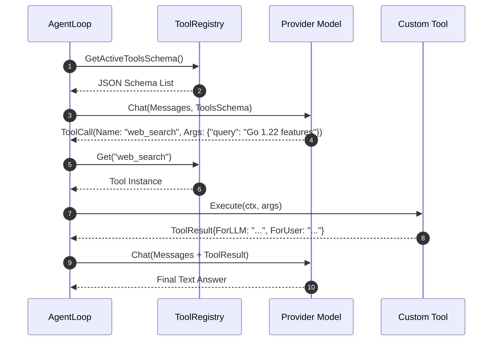

# Tools Core Concept

This document explains the architecture, registration, execution model, and best practices for **Tools** in MalikClaw.

---

## 1. Concept Explanation

A **Tool** in MalikClaw represents a capabilities extension that an agent can invoke during its reasoning loop. In Go, tools implement the [`tools.Tool`](../../pkg/tools/base.go) interface:

```go
type Tool interface {
	Name() string
	Description() string
	Parameters() map[string]any
	Execute(ctx context.Context, args map[string]any) *ToolResult
}
```

Tools can also optionally implement [`AsyncExecutor`](../../pkg/tools/base.go) for asynchronous long-running tasks.

---

## 2. Why It Exists

Large Language Models (LLMs) are restricted to text prediction based on static training datasets. Tools grant agents "hands and eyes"—allowing them to execute shell commands, read/write files, search the web, manage databases, communicate over hardware buses (I2C/SPI), or trigger background subagents.

---

## 3. When to Use

- Whenever an agent needs real-time information (e.g., current web search results, sensor readings).
- Whenever an agent needs to perform side effects in the host system (e.g., editing code files, running terminal commands).
- Whenever delegating tasks to secondary subagents asynchronously.

---

## 4. How It Works

1. **Registration**: Tools are registered into a thread-safe `ToolRegistry` ([`pkg/tools/registry.go`](../../pkg/tools/registry.go)).
2. **Schema Conversion**: `ToolToSchema(tool)` converts tool definitions into JSON Schema objects compatible with OpenAI/Anthropic tool calling conventions.
3. **Selection**: The LLM analyzes prompt input and decides whether to output text or emit a `tool_calls` request.
4. **Execution**: `AgentLoop` passes arguments and request-scoped context (channel, chatID) into `tool.Execute(ctx, args)`.
5. **Feedback**: The `ToolResult` (`ForLLM` and `ForUser`) is fed back into the conversation context for the model's next turn.

### Tool Execution Flow Diagram



---

## 5. Go Code Sample: Creating a Custom Synchronous Tool

```go
package main

import (
	"context"
	"fmt"

	"github.com/AbdullahMalik17/malikclaw/pkg/tools"
)

// CalculatorTool implements tools.Tool
type CalculatorTool struct{}

func (t *CalculatorTool) Name() string {
	return "calculator"
}

func (t *CalculatorTool) Description() string {
	return "Performs basic mathematical operations (add, subtract, multiply, divide)."
}

func (t *CalculatorTool) Parameters() map[string]any {
	return map[string]any{
		"type": "object",
		"properties": map[string]any{
			"operation": map[string]any{
				"type":        "string",
				"enum":        []string{"add", "subtract", "multiply", "divide"},
				"description": "The operation to perform",
			},
			"a": map[string]any{"type": "number", "description": "First operand"},
			"b": map[string]any{"type": "number", "description": "Second operand"},
		},
		"required": []string{"operation", "a", "b"},
	}
}

func (t *CalculatorTool) Execute(ctx context.Context, args map[string]any) *tools.ToolResult {
	op, _ := args["operation"].(string)
	a, okA := args["a"].(float64)
	b, okB := args["b"].(float64)

	if !okA || !okB {
		return tools.ErrorResult("invalid or missing numeric arguments 'a' and 'b'")
	}

	var result float64
	switch op {
	case "add":
		result = a + b
	case "subtract":
		result = a - b
	case "multiply":
		result = a * b
	case "divide":
		if b == 0 {
			return tools.ErrorResult("division by zero")
		}
		result = a / b
	default:
		return tools.ErrorResult("unknown operation")
	}

	outStr := fmt.Sprintf("%g %s %g = %g", a, op, b, result)
	return &tools.ToolResult{
		ForLLM:  outStr,
		ForUser: fmt.Sprintf("Calculated: %g", result),
	}
}
```

---

## 6. Request-Scoped Context

Tools are singletons stored in `ToolRegistry`. To pass request-scoped metadata (such as the incoming channel name or chat ID) without causing data races, MalikClaw uses context values via [`tools.WithToolContext`](../../pkg/tools/base.go):

```go
// Extracted inside Tool.Execute:
channel := tools.ToolChannel(ctx)
chatID  := tools.ToolChatID(ctx)
```

---

## 7. Common Mistakes

1. **Mutable State on Tool Singletons**: Storing request-specific fields on the tool struct (e.g., `t.CurrentChatID = chatID`), causing data races when agents process concurrent requests. Use `ctx.Value` or `tools.ToolChatID(ctx)` instead.
2. **Poor Parameter Descriptions**: Leaving `description` empty in parameter schemas. LLMs rely on parameter descriptions to format correct inputs.
3. **Returning Verbose Output to User**: Putting huge raw payloads in `ForUser`. Keep `ForUser` short and readable, placing detailed text in `ForLLM`.

---

## 8. Best Practices

- Validate all arguments cast from `map[string]any` before performing logic.
- Use `tools.ErrorResult("reason")` for soft operational errors so the LLM can self-correct.
- Implement `AsyncExecutor` for operations taking longer than a few seconds.

---

## 9. Cross-References

- [Agents Concept](agents.md): How agents invoke tool loops.
- [MCP Concept](mcp.md): Model Context Protocol tools integration.
- [Custom Tools Guide](../advanced/custom-tools.md): Step-by-step guide for complex custom tools.
- [Tools API Reference](../api/tools.md): Go doc specs for `pkg/tools`.
