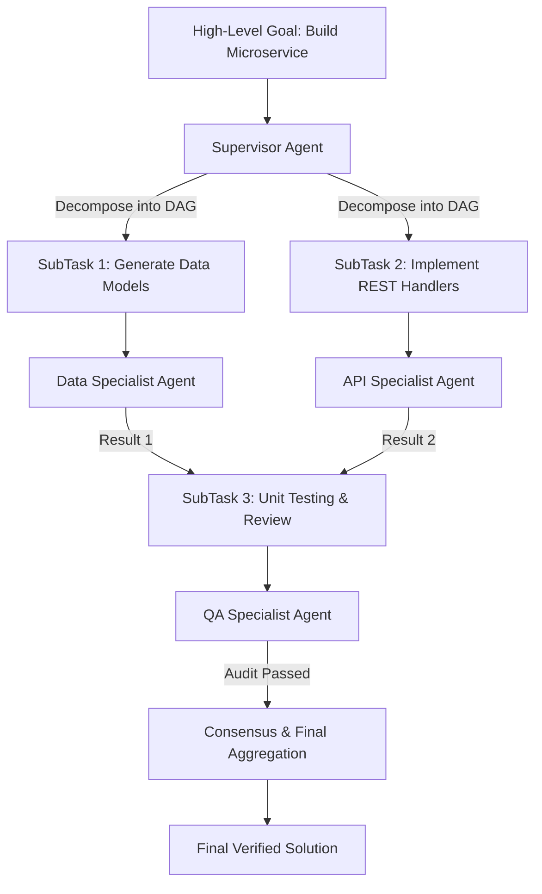

# Workflows & Swarm Orchestration Core Concept

This document details multi-agent workflows, DAG decomposition, supervisor patterns, and peer-to-peer swarm execution in **MalikClaw**.

---

## 1. Concept Explanation

Complex autonomous objectives often exceed the capability of a single monolithic agent. MalikClaw provides two multi-agent workflow models:

1. **Supervisor-Subagent Workflows**: Managed by [`agent.Supervisor`](../../pkg/agent/interfaces.go). A lead agent breaks a goal into subtasks, assigns them to specialized agents (e.g. Developer, Reviewer, Tester), and aggregates consensus.
2. **Swarm Peer Network**: Implemented in [`pkg/swarm/swarm.go`](../../pkg/swarm/swarm.go). Independent MalikClaw nodes run on distinct machines/containers, communicating via HTTP/JSON RPC to dispatch and process tasks across nodes.

---

## 2. Why It Exists

- Single LLM prompts degrade in reasoning quality when given excessively broad tasks.
- Parallel processing of independent subtasks dramatically reduces total execution latency.
- Specialized subagents (with custom tools, system prompts, and model profiles) perform better than a single general-purpose agent.

---

## 3. When to Use

- Large software engineering tasks requiring design, coding, unit testing, and documentation steps.
- Distributed cluster operations where different edge nodes execute local hardware or OS operations.
- Multi-agent debate or verification loops where outputs require consensus approval.

---

## 4. How It Works

### Supervisor DAG & Consensus Flow



### Swarm Node Communication

Each `swarm.Swarm` node exposes HTTP endpoints (`/task/dispatch`, `/health`) to receive and process `swarm.Task` payloads concurrently.

---

## 5. Go Code Sample: Swarm Node & Task Dispatching

```go
package main

import (
	"context"
	"fmt"
	"log"
	"time"

	"github.com/AbdullahMalik17/malikclaw/pkg/swarm"
)

func main() {
	ctx, cancel := context.WithTimeout(context.Background(), 10*time.Second)
	defer cancel()

	// 1. Define task handler for local node
	taskHandler := func(ctx context.Context, task swarm.Task) (swarm.TaskResult, error) {
		fmt.Printf("Received task [%s] for agent [%s]: %s\n", task.ID, task.AgentID, task.Payload)
		return swarm.TaskResult{
			TaskID: task.ID,
			Result: "Execution completed successfully",
			NodeID: "local-node-1",
		}, nil
	}

	// 2. Instantiate and start local Swarm node
	cfg := swarm.Config{
		NodeID:   "node-alpha",
		BindAddr: ":7331",
	}
	s := swarm.NewSwarm(cfg, taskHandler)

	err := s.Start(ctx)
	if err != nil {
		log.Fatalf("Failed to start swarm node: %v", err)
	}
	defer s.Stop(ctx)

	// 3. Register peer node and dispatch remote task
	s.RegisterPeer(&swarm.Node{
		ID:       "node-beta",
		Address:  "127.0.0.1:7331",
		LastSeen: time.Now(),
	})

	task := swarm.Task{
		ID:         "task-999",
		AgentID:    "coder",
		Payload:    "Run static analysis on pkg/agent",
		SessionKey: "session-001",
	}

	res, err := s.Dispatch(ctx, "node-beta", task)
	if err != nil {
		log.Fatalf("Dispatch error: %v", err)
	}

	fmt.Printf("Remote Task Result from %s: %s\n", res.NodeID, res.Result)
}
```

---

## 6. Common Mistakes

1. **Circular DAG Dependencies**: Defining subtask dependencies where Task A depends on Task B and Task B depends on Task A, deadlocking execution.
2. **Unbounded Debate Rounds**: Setting `ConsensusRules.MaxDebateRounds` to zero or unlimited, allowing subagents to debate endlessly without converging.

---

## 7. Best Practices

- Validate DAG structure (ensure no cycles) before triggering subtask dispatch.
- Always include `MaxDebateRounds` (e.g. 3) and `RequireUnanimous` flags in `ConsensusRules`.
- Implement heartbeats for distributed swarm nodes so dead nodes are pruned automatically.

---

## 8. Cross-References

- [Agents Concept](agents.md): Core agent interfaces and execution loops.
- [Routing Concept](routing.md): Specialist provider routing.
- [Agent API Reference](../api/agent.md): Go struct specs for `Supervisor` and `AgentInstance`.
