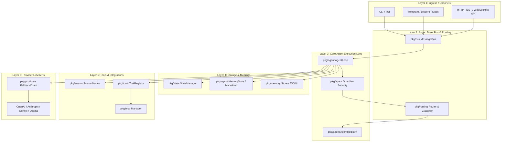

# Architecture Overview

This document provides a comprehensive technical architecture overview of **MalikClaw**.

---

## 1. Concept Explanation

MalikClaw is built using a **layered, decoupled event-driven architecture**. It uses Go channels and a central `MessageBus` to connect inbound user channels (CLI, Web, Telegram, Discord) with the `AgentLoop` execution engine, `ToolRegistry`, `MemoryStore`, and `LLMProvider` backends.

---

## 2. Why It Exists

Understanding system boundaries and data flow prevents architectural degradation, cyclic package dependencies, and memory leaks as the framework evolves.

---

## 3. Layered Architecture System Map



---

## 4. Subsystem Responsibilities

1. **`pkg/bus`**: Low-latency event bus handling non-blocking channel publishing and subscription for inbound/outbound messages.
2. **`pkg/agent`**: Manages the Observe-Plan-Execute-Evaluate agent loop, prompt injection security, system instruction assembly, and multi-agent supervision.
3. **`pkg/tools`**: Thread-safe tool registration, schema generation for LLM APIs, request-scoped context propagation, and async execution callbacks.
4. **`pkg/memory`**: Dual-tier storage handling short-term conversation turns (`memory.Store`) and long-term memory notes (`agent.MemoryStore`).
5. **`pkg/providers`**: Unified LLM provider abstraction handling OpenAI, Anthropic, Gemini, DeepSeek, and Ollama APIs with automatic fallback chains.
6. **`pkg/mcp`**: Dynamic discovery and JSON-RPC wrapping of external Model Context Protocol tool servers.
7. **`pkg/swarm`**: Peer-to-peer node network for distributed multi-machine agent task execution.

---

## 5. Go Code Sample: Wiring the Complete System Architecture

```go
package main

import (
	"context"
	"fmt"

	"github.com/AbdullahMalik17/malikclaw/pkg/agent"
	"github.com/AbdullahMalik17/malikclaw/pkg/bus"
	"github.com/AbdullahMalik17/malikclaw/pkg/config"
	"github.com/AbdullahMalik17/malikclaw/pkg/memory"
	"github.com/AbdullahMalik17/malikclaw/pkg/state"
	"github.com/AbdullahMalik17/malikclaw/pkg/tools"
)

func main() {
	_ = context.Background()

	// 1. Config & State Manager
	cfg := config.DefaultConfig()
	stateMgr := state.NewManager("./workspace/state")

	// 2. Event Bus & Memory Store
	msgBus := bus.NewMessageBus()
	sessionStore, _ := memory.NewJSONLStore("./workspace/sessions.jsonl")
	defer sessionStore.Close()

	// 3. Tool & Agent Registries
	toolReg := tools.NewToolRegistry()
	toolReg.Register(tools.NewFileSystemTool("./workspace"))
	agentReg := agent.NewAgentRegistry()

	// 4. Agent Loop Engine
	loop := agent.NewAgentLoop(cfg, msgBus, agentReg, toolReg)

	fmt.Printf("MalikClaw Full Stack Wired. State Active: %v, Loop Ready: %v\n",
		stateMgr != nil, loop != nil)
}
```

---

## 6. Common Mistakes

1. **Cyclic Dependencies**: Importing `pkg/agent` inside `pkg/tools` or vice-versa. Always use clean interface abstractions (`tools.Tool`, `agent.Planner`).
2. **Global State**: Creating package-level global variables rather than instantiating structs cleanly in `cmd/malikclaw`.

---

## 7. Best Practices

- Keep package dependencies strictly unidirectional.
- Rely on Go interfaces (`tools.Tool`, `memory.Store`, `tools.LLMProvider`) to facilitate unit testing with mock implementations.

---

## 8. Cross-References

- [Contribution Guidelines](guidelines.md): Code standards and pull request workflows.
- [API Reference Overview](../api/overview.md): Complete Go package map.
- [Agents Concept](../concepts/agents.md): Agent loop concept guide.
