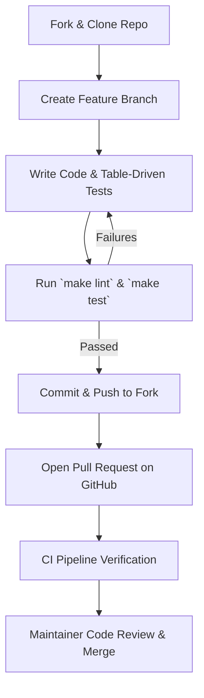

# Contribution Guidelines

Thank you for your interest in contributing to **MalikClaw**! This document outlines code standards, pull request workflows, testing rules, and linter requirements.

---

## 1. Concept Explanation

MalikClaw is an open-source Go AI agent framework licensed under the MIT License. We welcome bug fixes, performance optimizations, new channel connectors, and tool integrations.

---

## 2. Why It Exists

To maintain high code quality, low memory overhead (~15–30 MB RSS), and fast execution speed, all contributions must adhere to clean Go conventions and test coverage guidelines.

---

## 3. When to Use

Refer to this guide prior to opening issues, writing code, or submitting Pull Requests (PRs).

---

## 4. Pull Request Workflow

1. **Fork the Repository**: Create your own fork on GitHub.
2. **Create a Feature Branch**: `git checkout -b feature/my-new-tool`
3. **Write Code & Unit Tests**: Ensure table-driven tests are added for new functions.
4. **Run Verification Suite**:
   ```bash
   make lint       # Run golangci-lint
   make test       # Run all unit tests
   make build      # Verify binary compilation
   ```
5. **Submit a Pull Request**: Provide a clear explanation of changes and linked issue numbers.

### Contribution Workflow Diagram



---

## 5. Coding Standards

- **Formatting**: Always format code using standard Go rules (`gofmt` / `goimports`).
- **Concurrency**: Avoid global mutable variables. Protect shared resources with `sync.RWMutex` or use channels.
- **Context Propagation**: Always pass `context.Context` as the first argument in I/O or network functions.
- **Errors**: Return explicit wrapped errors using `fmt.Errorf("action failed: %w", err)` rather than ignoring errors or calling `panic()`.

---

## 6. Go Code Sample: Writing Unit Tests

Unit tests should use table-driven tests:

```go
package tools_test

import (
	"context"
	"testing"

	"github.com/AbdullahMalik17/malikclaw/pkg/tools"
)

func TestCalculatorTool_Execute(t *testing.T) {
	calc := &tools.CalculatorTool{}
	ctx := context.Background()

	tests := []struct {
		name    string
		args    map[string]any
		isError bool
	}{
		{
			name:    "valid addition",
			args:    map[string]any{"operation": "add", "a": 10.0, "b": 20.0},
			isError: false,
		},
		{
			name:    "division by zero",
			args:    map[string]any{"operation": "divide", "a": 10.0, "b": 0.0},
			isError: true,
		},
	}

	for _, tt := range tests {
		t.Run(tt.name, func(t *testing.T) {
			res := calc.Execute(ctx, tt.args)
			if res.IsError != tt.isError {
				t.Errorf("expected isError=%v, got=%v", tt.isError, res.IsError)
			}
		})
	}
}
```

---

## 7. Common Mistakes

1. **Ignoring Context Expiry**: Hardcoding long sleeps or uncancelable loops without listening to `ctx.Done()`.
2. **Submitting Untested Code**: Adding new tools or channels without unit test coverage.
3. **CGO Dependencies**: Introducing CGO dependencies into core packages, breaking pure Go cross-compilation.

---

## 8. Best Practices

- Keep pull requests focused on a single feature or bug fix.
- Verify binary size remains minimal using `make build`.

---

## 9. Cross-References

- [Architecture Overview](architecture-overview.md): High-level system design.
- [Installation Guide](../getting-started/installation.md): Building from source.
