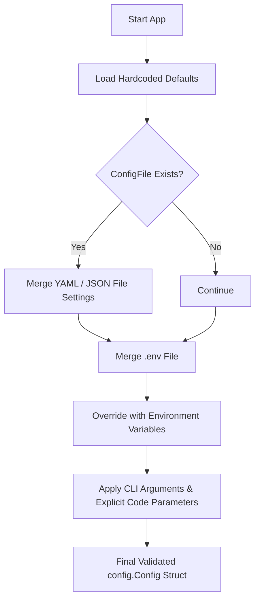

# System Configuration Guide

This guide details how to configure **MalikClaw** using configuration files, environment variables, and programmatically in Go.

---

## 1. Concept Explanation

Configuration in MalikClaw controls all runtime behaviors of the agent ecosystem: LLM provider credentials, model selection, tool sandbox restrictions, context window limits, channel credentials (Telegram, Discord, Slack), and swarm networking parameters. MalikClaw utilizes a unified configuration struct (`config.Config`) defined in [`pkg/config/config.go`](../../pkg/config/config.go).

---

## 2. Why It Exists

Applications often run in varying environments (local dev machine, CI/CD pipelines, production Kubernetes clusters, or edge micro-controllers). Centralized configuration decouples execution logic from deployment settings and API keys.

---

## 3. When to Use

- When switching between LLM providers (e.g., OpenAI, Anthropic, Ollama, DeepSeek).
- When tuning agent loop parameters like max execution steps, max tokens, and temperature.
- When enabling security sandboxes, MCP servers, or multi-channel integration.

---

## 4. How It Works

MalikClaw loads configuration parameters following a defined precedence hierarchy:
1. **Command Line Flags / Code Overrides** (highest priority)
2. **Environment Variables** (e.g., `OPENAI_API_KEY`, `MALIKCLAW_LLM_MODEL`)
3. **Configuration File** (`config.yaml`, `config.json`, or `.env`)
4. **Default Values** (`config.DefaultConfig()`)

### Configuration Loading Hierarchy Diagram



---

## 5. Configuration Schema & Options

### Sample `config.yaml` File

```yaml
agent:
  name: "malikclaw-main"
  max_iterations: 15
  system_prompt: "You are a helpful AI software engineer."

llm:
  provider: "openai"
  model: "gpt-4o-mini"
  api_key: "sk-proj-..."
  temperature: 0.7
  max_tokens: 4096
  timeout_seconds: 60
  fallback_providers:
    - provider: "anthropic"
      model: "claude-3-5-sonnet-20241022"

storage:
  workspace: "./workspace"
  memory_dir: "./workspace/memory"
  session_db: "./workspace/sessions.jsonl"

channels:
  telegram:
    enabled: false
    token: ""
  discord:
    enabled: false
    token: ""

security:
  enable_prompt_injection_guard: true
  allowed_exec_commands:
    - "git"
    - "go"
    - "ls"
```

---

## 6. Go Code Sample: Programmatic Configuration

Below is a Go code sample showing how to load, inspect, and programmatically modify MalikClaw configuration:

```go
package main

import (
	"fmt"
	"log"

	"github.com/AbdullahMalik17/malikclaw/pkg/config"
)

func main() {
	// 1. Load configuration with environment variable support
	cfg, err := config.LoadConfig("config.yaml")
	if err != nil {
		log.Printf("Notice: config.yaml not found, loading defaults: %v", err)
		cfg = config.DefaultConfig()
	}

	// 2. Programmatically override specific parameters
	cfg.LLM.Provider = "anthropic"
	cfg.LLM.Model = "claude-3-5-sonnet-20241022"
	cfg.Agent.MaxIterations = 20

	// 3. Validate configuration
	if err := cfg.Validate(); err != nil {
		log.Fatalf("Invalid configuration: %v", err)
	}

	fmt.Printf("Configured Agent:  %s\n", cfg.Agent.Name)
	fmt.Printf("Active Provider:   %s (%s)\n", cfg.LLM.Provider, cfg.LLM.Model)
	fmt.Printf("Workspace Path:    %s\n", cfg.Storage.Workspace)
}
```

---

## 7. Common Mistakes

1. **Storing Raw Secrets in Version Control**: Committing `config.yaml` with hardcoded API keys into Git repositories. Use `.env` or environment variables instead.
2. **Missing Field Validation**: Passing zero values for critical options like `TimeoutSeconds` or `MaxIterations`, which can cause instant timeouts or infinite agent loops.
3. **Path Traversal in Workspace**: Using uncleaned relative workspace paths in multi-tenant environments.

---

## 8. Best Practices

- Use environment variables (`OPENAI_API_KEY`, `ANTHROPIC_API_KEY`) for sensitive credentials.
- Always invoke `cfg.Validate()` after programmatically building configuration structs.
- Use distinct configuration profiles for testing, staging, and production environments.

---

## 9. Cross-References

- [Installation Guide](installation.md): Set up the binary and system paths.
- [First Agent Guide](first-agent.md): Pass configuration to `AgentLoop`.
- [Providers Concept Document](../concepts/providers.md): Understand multi-provider fallback chains.
