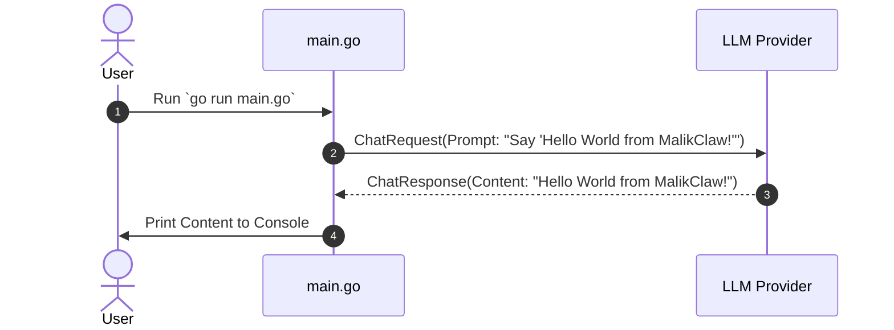

# Hello World Quickstart

This tutorial walks through creating a simple "Hello World" application using **MalikClaw**.

---

## 1. Concept Explanation

A "Hello World" application in MalikClaw demonstrates the smallest possible agent program. It verifies that your Go environment, LLM provider credentials, and MalikClaw packages are correctly integrated.

---

## 2. Why It Exists

Before building complex multi-agent workflows or registering custom tools, you need a quick baseline test to confirm network connectivity, authentication, and basic message processing.

---

## 3. When to Use

- When setting up MalikClaw in a new project or container for the first time.
- When smoke-testing new LLM provider credentials or API key permissions.

---

## 4. How It Works

The Hello World application initializes a lightweight agent, sends a single text prompt ("Say 'Hello World from MalikClaw!'"), processes the response synchronously, and prints the result to stdout.

### Hello World Sequence Diagram



---

## 5. Go Code Sample

Save the following code in a file named `hello_world.go`:

```go
package main

import (
	"context"
	"fmt"
	"log"
	"os"
	"time"

	"github.com/AbdullahMalik17/malikclaw/pkg/providers"
)

func main() {
	ctx, cancel := context.WithTimeout(context.Background(), 10*time.Second)
	defer cancel()

	apiKey := os.Getenv("OPENAI_API_KEY")
	if apiKey == "" {
		log.Fatal("Error: OPENAI_API_KEY environment variable is required.")
	}

	// Instantiate the OpenAI provider directly
	provider := providers.NewOpenAIProvider(apiKey, "gpt-4o-mini", "")

	messages := []providers.Message{
		{
			Role:    "user",
			Content: "Say 'Hello World from MalikClaw!' in a friendly tone.",
		},
	}

	resp, err := provider.Chat(ctx, messages, nil, "gpt-4o-mini", nil)
	if err != nil {
		log.Fatalf("Provider chat error: %v", err)
	}

	fmt.Println("----------------------------------------")
	fmt.Printf("Model Response: %s\n", resp.Content)
	fmt.Println("----------------------------------------")
	if resp.Usage != nil {
		fmt.Printf("Tokens Used:    %d (Prompt: %d, Completion: %d)\n",
			resp.Usage.TotalTokens, resp.Usage.PromptTokens, resp.Usage.CompletionTokens)
	}
}
```

### Running the Example

```bash
export OPENAI_API_KEY="sk-proj-your-key-here"
go run hello_world.go
```

**Expected Output**:
```text
----------------------------------------
Model Response: Hello World from MalikClaw! I'm ready to assist you.
----------------------------------------
Tokens Used:    32 (Prompt: 19, Completion: 13)
```

---

## 6. Common Mistakes

1. **Unset Environment Variable**: Running without setting `OPENAI_API_KEY` (or provider equivalent) results in an authentication error.
2. **No Timeout Context**: Omitting `context.WithTimeout` can cause your program to hang indefinitely if the API network call blocks.

---

## 7. Best Practices

- Always check returned errors from `provider.Chat`.
- Check `resp.Usage` to monitor token consumption during development.

---

## 8. Cross-References

- [Installation Guide](installation.md): Set up MalikClaw.
- [First Agent Guide](first-agent.md): Build an agent loop with tool capabilities.
- [Examples: Hello World](../examples/hello-world.md): Full example with tool calling and message bus.
