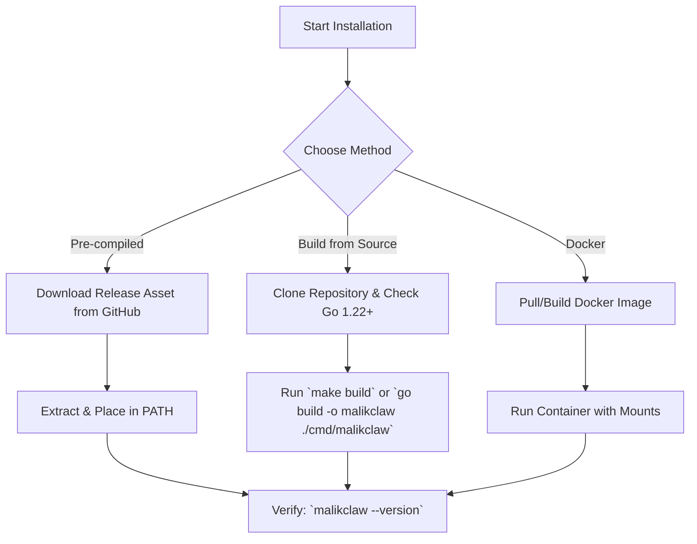

# Installation Guide

Welcome to **MalikClaw**, an ultra-lightweight, high-performance personal AI agent framework written in Go. This document covers installing MalikClaw from pre-compiled binaries, compiling from source, running via Docker, and setting up your local Go environment.

---

## 1. Concept Overview

MalikClaw is designed as a single native Go binary with zero required runtime dependencies. It supports cross-platform execution (Linux, macOS, Windows) and low memory consumption (~15–30 MB RSS).

```
                      +-----------------------------+
                      |   Source / Release Artifact |
                      +--------------+--------------+
                                     |
           +-------------------------+-------------------------+
           |                         |                         |
           v                         v                         v
   [ Binary Release ]       [ Build from Source ]      [ Docker Container ]
           |                         |                         |
           +-------------------------+-------------------------+
                                     |
                                     v
                       +---------------------------+
                       | MalikClaw Executable CLI  |
                       +---------------------------+
```

---

## 2. Why It Exists

MalikClaw provides an ultra-fast agent execution engine with minimal resource overhead, enabling deployment anywhere from small IoT devices (Raspberry Pi, MaixCam) to serverless cloud containers and local developer desktops.

---

## 3. When to Use

- **Local Development**: Instant setup with `go build` or pre-built binaries.
- **Production Server**: Docker containers or systemd daemons for 24/7 autonomous agents.
- **Edge / Embedded**: Lightweight binary deployment on arm64/armv7 devices.

---

## 4. How It Works

MalikClaw uses standard Go tooling (`go build`) with optional CGO dependencies for specific audio/DSP plugins. When built, it produces a self-contained executable that reads configuration from environment variables or a YAML/JSON configuration file.

### Installation Flow Diagram



---

## 5. Step-by-Step Installation Instructions

### Option A: Pre-compiled Binaries (Recommended)

1. Download the latest binary for your operating system and architecture from GitHub Releases.
2. Extract the archive and move `malikclaw` (or `malikclaw.exe`) to your system executable path:

```bash
# Linux / macOS
tar -xzf malikclaw_Linux_x86_64.tar.gz
sudo mv malikclaw /usr/local/bin/
chmod +x /usr/local/bin/malikclaw

# Windows (PowerShell)
Expand-Archive -Path malikclaw_Windows_x86_64.zip -DestinationPath C:\Tools\
[Environment]::SetEnvironmentVariable("Path", $env:Path + ";C:\Tools\", "User")
```

### Option B: Building from Source

**Prerequisites**:
- Go 1.22 or higher installed (`go version`)
- Git

```bash
# Clone the repository
git clone https://github.com/AbdullahMalik17/malikclaw.git
cd malikclaw

# Build the main CLI executable
make build
# or manually:
go build -ldflags="-s -w" -o bin/malikclaw ./cmd/malikclaw

# Verify binary
./bin/malikclaw --version
```

### Option C: Docker Container Deployment

MalikClaw provides multi-arch Docker images and a minimal `Dockerfile`:

```bash
# Build the Docker image locally
docker build -t malikclaw:latest .

# Run container with environment variables and workspace mount
docker run -d \
  --name malikclaw \
  -e OPENAI_API_KEY="your-api-key" \
  -v $(pwd)/workspace:/app/workspace \
  malikclaw:latest
```

---

## 6. Go Code Sample: Verifying Environment Programmatically

You can check MalikClaw version and configuration programmatically in Go:

```go
package main

import (
	"fmt"
	"runtime"

	"github.com/AbdullahMalik17/malikclaw/pkg/constants"
)

func main() {
	fmt.Printf("MalikClaw Version: %s\n", constants.Version)
	fmt.Printf("Go Version:        %s\n", runtime.Version())
	fmt.Printf("OS/Arch:           %s/%s\n", runtime.GOOS, runtime.GOARCH)
}
```

---

## 7. Common Mistakes

1. **Outdated Go Version**: Building with Go < 1.22 will fail due to usage of newer standard library features (such as `range` over integers and enhanced `net/http` routing).
2. **Missing API Keys**: Launching the agent without setting `OPENAI_API_KEY`, `ANTHROPIC_API_KEY`, or custom provider endpoints will result in provider initialization failures.
3. **CGO Conflicts**: Enabling CGO on systems without a GCC compiler installed when compiling SQLite or audio support modules. Set `CGO_ENABLED=0` if pure Go builds are required.

---

## 8. Best Practices

- **Security**: Never commit `.env` files or API keys into source repositories.
- **Production**: Use `make build` with `-ldflags="-s -w"` to strip debug symbols and reduce binary size.
- **Service Management**: Use systemd or Docker restart policies (`restart: unless-stopped`) for continuous background agent execution.

---

## 9. Cross-References

- [First Agent Guide](first-agent.md): Build and run your first autonomous agent.
- [Configuration Guide](configuration.md): Configure environment variables and YAML settings.
- [Hello World Example](hello-world.md): Minimal end-to-end code example.
